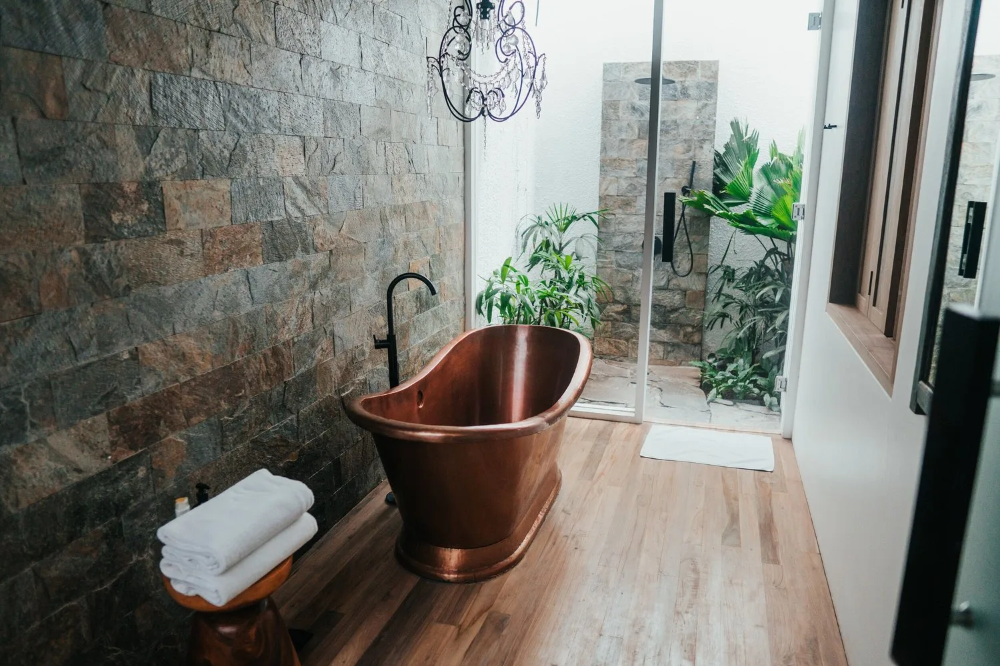
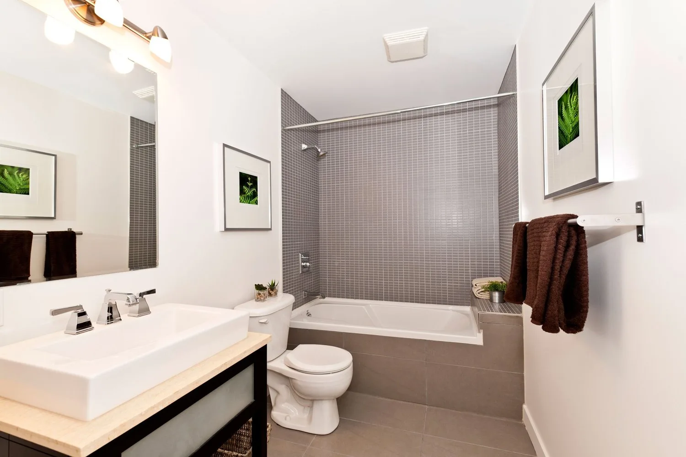
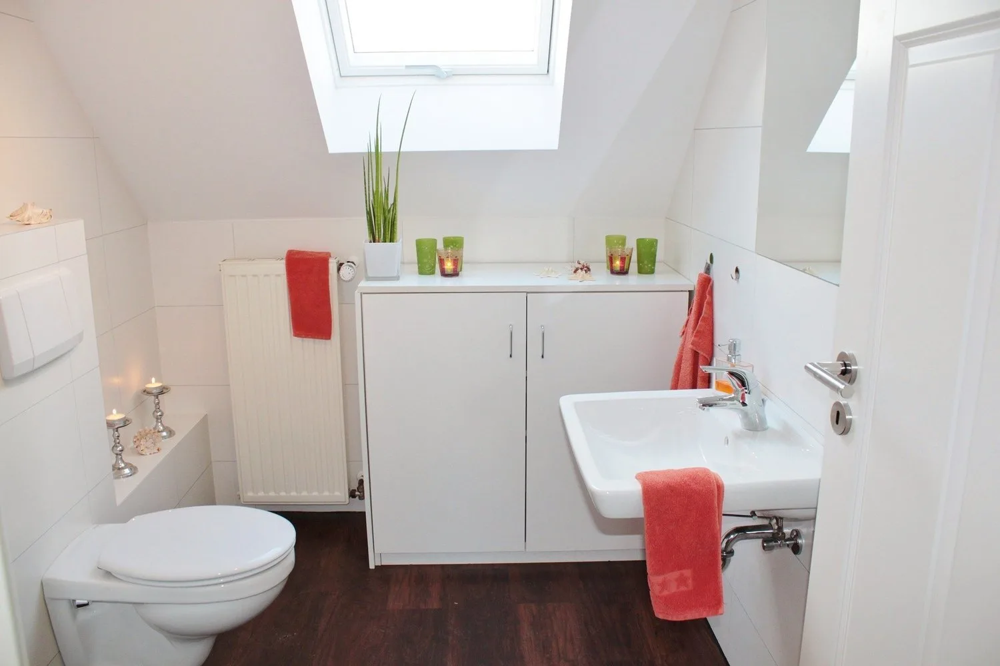
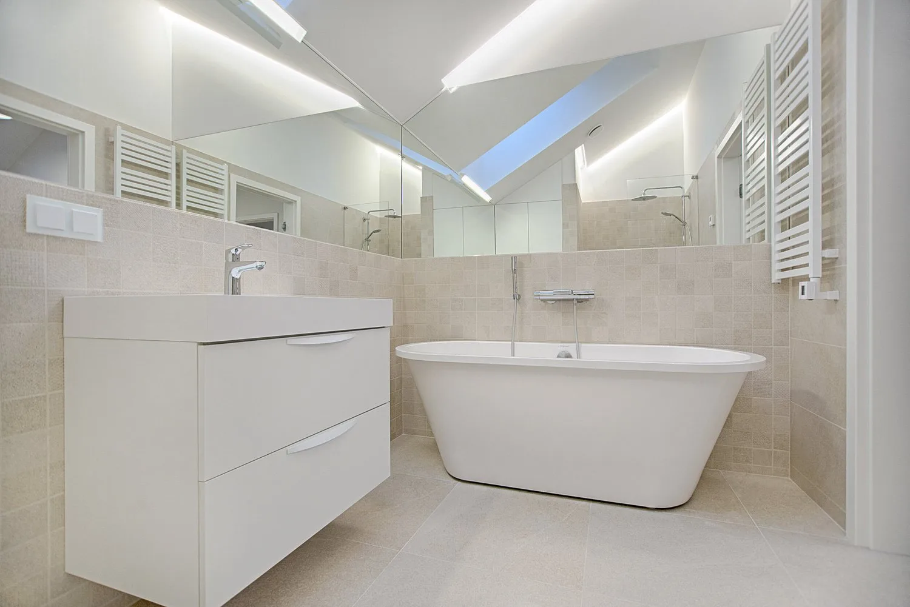
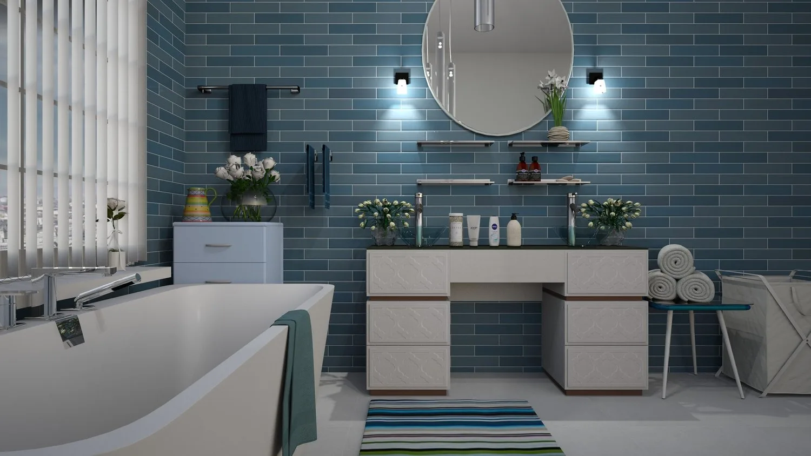
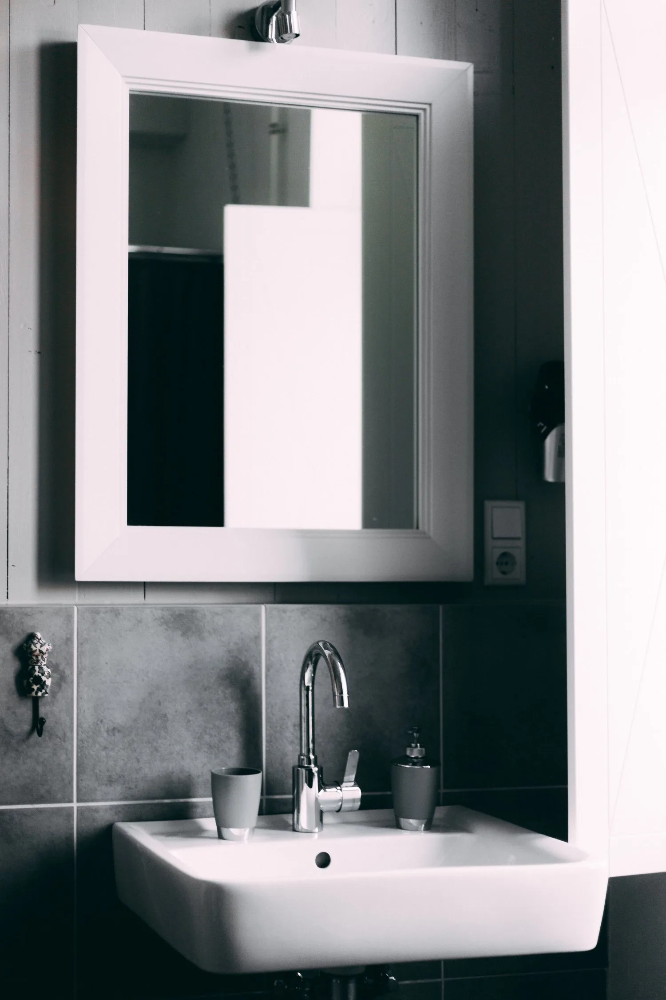
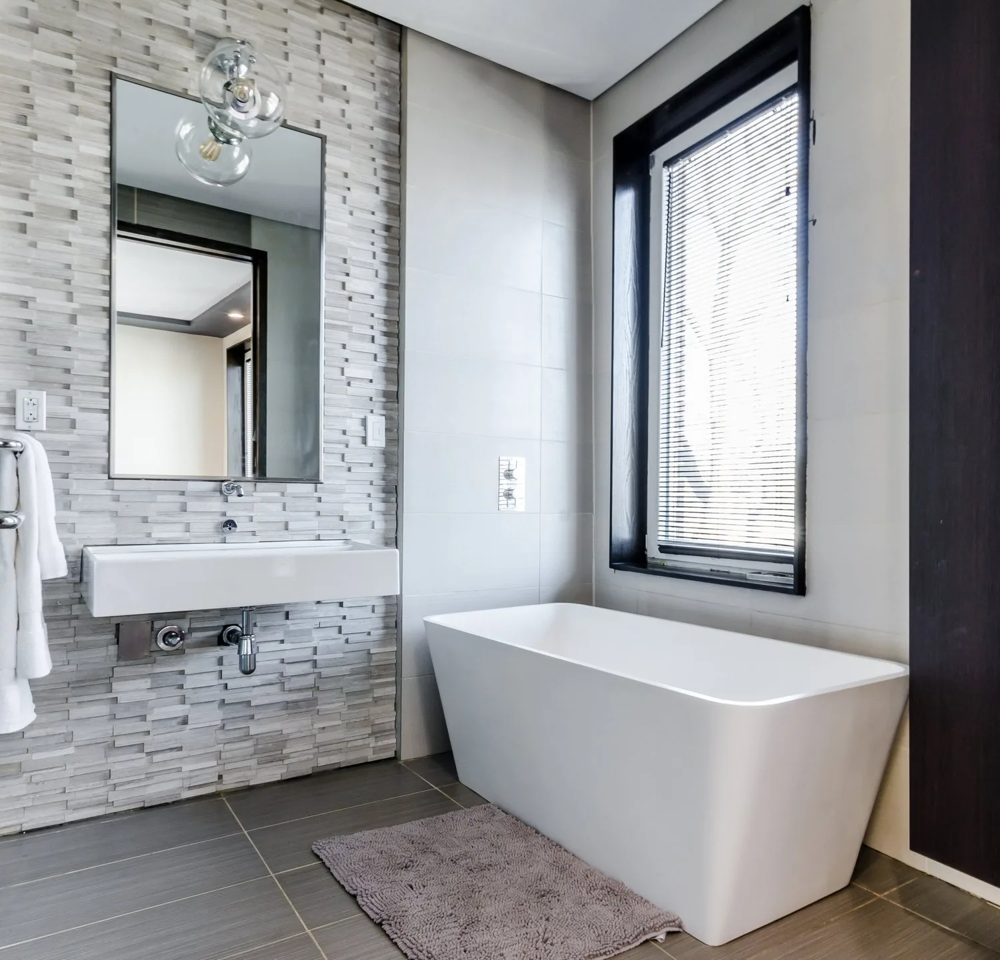

The bathroom is one of the most Important rooms in your home. It can be your haven from the stresses and strains of life, a place where you go to decompress and relax. It should be beautiful and functional for all the family. It can be your very own relaxing spa if designed correctly and add value to your home.

Don’t forget also that small can be beautiful. You may not have a large bathroom but with some clever thought and design your small bathroom can be beautiful too.

### 1)Think outside the box

Don’t just look at what your bathroom is like currently. Think about what you would like to achieve with your bathroom renovation or you would like to have as a finished product regardless of price. Look at images, pictures and magazines for ideas. The sky is the limit.

### 2)Utilise the space to the best you can

With so many different styles of baths, showers, hand basins and toilets, you would be surprised as to what you can fit into your bathroom if you think carefully about it. Wall hung toilets and wash hand basins free up lots of floor space and are easier to clean, while slim hand basins take up less room but can still be modern and stylish. Wall hung cabinets allow for great storage areas without being too cluttered. Corner baths, deep Japanese style baths and short baths are all available if you can’t fit a full-size bath into your new bathroom. Showers too can be luxurious so think about what type of shower head you want, the pressure in your shower and if you want to put in a shower tray or create a wet room for more space. Using underfloor heating means you don’t need space for a radiator or towel rail.

### 3)Don’t think you have to stick with the same layout

Pipes and wires can be moved so do not stick with the same layout that you already have. There may be a better way to design and lay out your bathroom than the way it was installed originally. Your bathroom renovation gives you the freedom to start again and make your bathroom a different room.

### 4)Think of your bathroom as an investment

For such an important room in your house, think of renovating your bathroom as an investment. You will not be renovating your bathroom for many years to come so you want to make sure that you put in the best that you can afford. Invest in good sanitary ware as well as fixtures and fittings. Cheaper ones tend to chip or crack over time, cheap fixtures and fittings break down and need replacing.

### 5) Future proof your bathroom

Design your bathroom for the future not just for now. You will not want to renovate your bathroom again for a long time to come so think about your future needs. Is the bathroom for both adults and children? Are you getting on in age and need your bathroom to be easily accessible? Don’t necessarily go with the current trends of colour and style of tiles as these may date very quickly. Go for the latest technology if it is available to you. Could you use underfloor heating run by electricity rather than using a radiator or towel rail?

### 6) Not everything has to be expensive

Lighting and mirrors can play a huge part in making your bathroom renovation a success and don’t have to be expensive. Think about your lighting from both a practical and a mood creating point of view to give you the option of turning your bathroom into a relaxing space. Mirrors too can help you create a feeling of space and light. Splashes of colour in your candles, towels and even your soaps etc can help create that space you want.

### 7)Think carefully about your tile choice

Large tiles are generally not recommended for small spaces in your bathroom renovation, but tiny tiles up the number of distracting grout lines. Medium scale varieties with a long profile can lengthen walls. Dramatic colours and over excited patterning are dubious choices that can draw the walls in, but texture can add another dimension to a more discreet pale choice. Pricier metallic and glass tiles offer reflections and a stunning play of light. If you find floor-to-ceiling too expensive, stop the tiling at dado height, lifting it to the ceiling or shoulder height in the showering area. You can also run tiling through the floor, walls and right around the bath as a unifying feature that will expand the apparent space. Painted walls in the remaining areas can carry the colour missing elsewhere offering a chance for change in the future. Non-slip tiles on the floor are very important too.

There is a lot of think about for your bathroom renovation but don’t despair. Contact a reputable plumber and bathroom specialist and they can advise you on layout, fixtures and fittings and design to give you a quotation on costs.

If you are looking to have your bathroom renovated, contact Tony at TMG Plumbing & Heating Services for advice, a site visit and quotation click here - [Bathroom Renovations](/contact)
