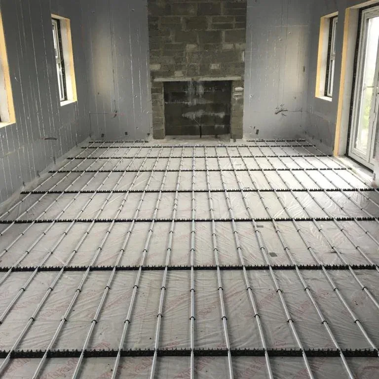
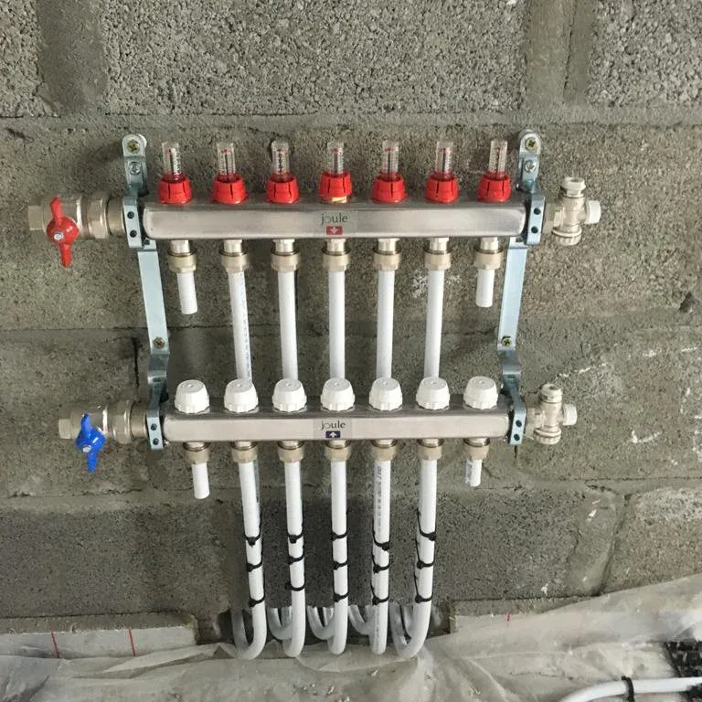
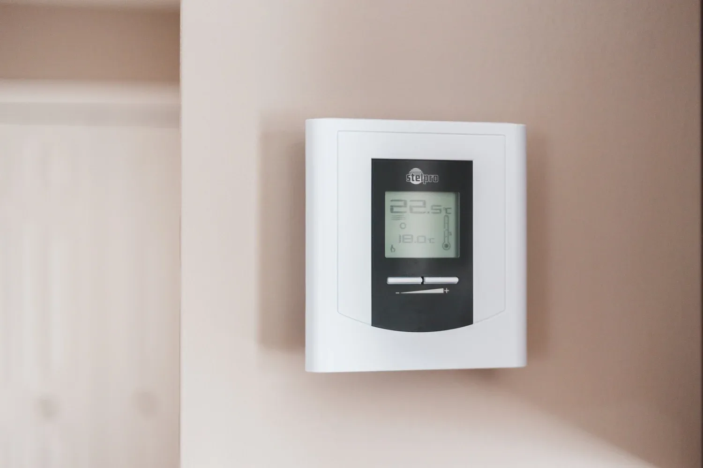
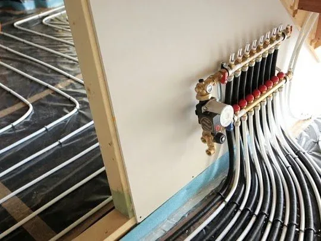
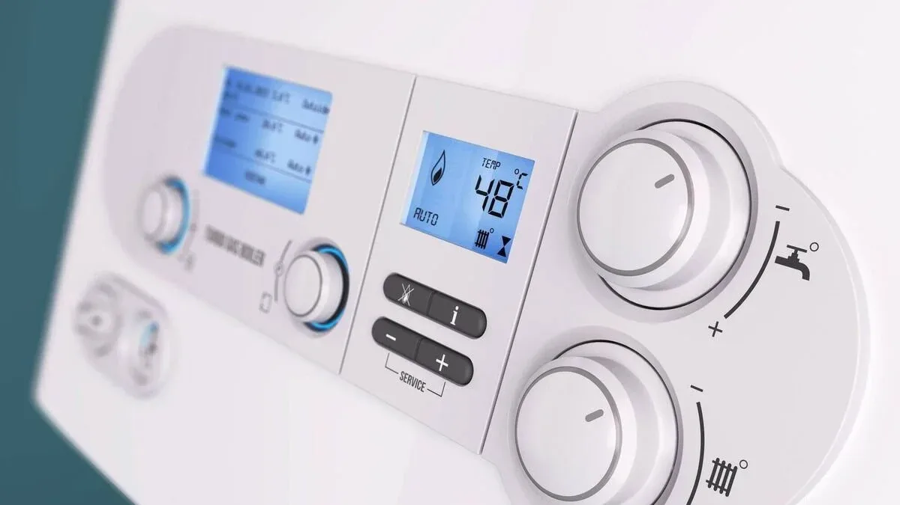
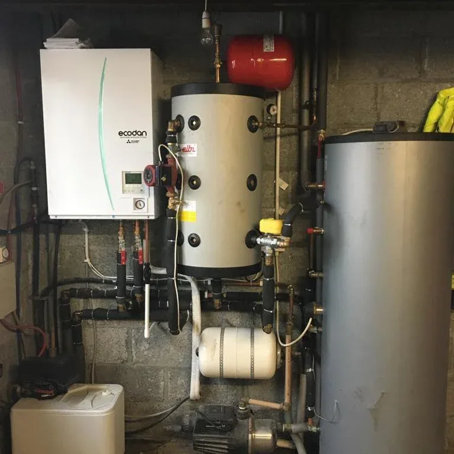
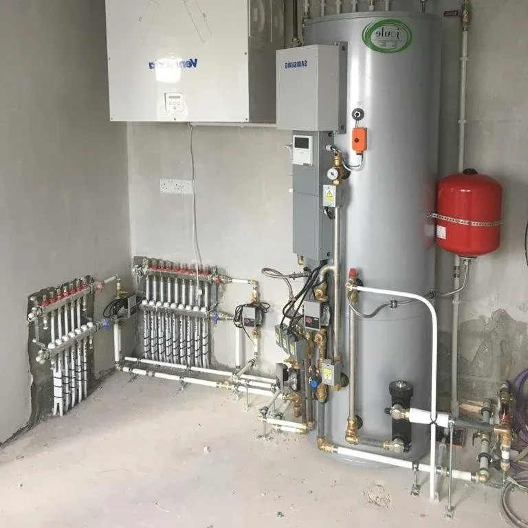

While underfloor heating is generally a very reliable heating system, sometimes things go wrong and either your heating system is not working efficiently, or it stops working altogether. By knowing some of the common problems, it can help either you or your heating engineer to rectify the issues and get you back up and running as quickly as possible.

#### Trapped Air or Blockages

Trapped air in the pipework is one of the most common problems with underfloor heating. An air bubble can get stuck in one section of the pipework and cause issues with the whole heating system. By opening each valve individually and bleeding the air out, the valves will release air along some water. It is best to get a qualified plumber to do this for you. You can also flush water through the pipes, which will clean the pipes and flush out air at the same time. If there are blockages in your pipework other than air, you may need to get your system flushed out to remove all and any debris that may build up over time.

If you would like to enquire about getting your underfloor heating power flushed please fill out our contact us page [Contact Us](/contact).

#### Actuator not working properly

It could be that either the actuator is stuck in place or the pin in the actuator is stuck. By freeing the actuator with some silicone spray or freeing pin with a pliers this may solve the issue. Alternatively, the actuator corresponding to the zone that is not working properly could have failed completely. If this is the case it is better to get a registered electrician to check it out.

#### Faulty thermostats

If your room thermostats are not working correctly, this may cause either your underfloor heating to not heat up correctly or to not turn off at all. By resetting your thermostats and checking the batteries, if your thermostats are wireless, if may resolve your problem. If this does not correct the fault with your heating, an electrician can check that your thermostats are wired correctly and in proper working order.

#### Leaks in the pipework

If the system keeps losing pressure, it may mean there is a leak somewhere in your pipework. When the pressure drops, top your system up and monitor the pressure. If the pressure stays low, go back a step and check that the connecting pipes to the manifold are in place and not leaking. If the pipes are leaking and you have only had it recently installed, then you should have go back to your installer for them to remedy the fault. Unfortunately, this may mean pulling up floors and is a substantial job.

#### Boiler needs servicing

If your underfloor heating is not heating up as well as it should, it may be that your boiler is not running correctly. By getting your boiler serviced, any faults will show up to your heating engineer who will be able to repair or replace any parts of the boiler that may have failed.

#### Circulating Pump Failure

If your underfloor heating is not heating up at all it could be that the hot water is not circulating around the underfloor pipework due to your circulation pump failing. This can be checked by your heating engineer and replaced if necessary.

#### Mixing Valve and Water Temperature

Check the temperature on the mixing valve and the flow and return. Generally, the water temperature should be between 35 – 60 °C. If your boiler or heat pump is not set to the correct temperature, no matter how long you run your heating for it will not heat up to the desired temperature.

#### Floor Covering

Check that the floor covering you have chosen for your home is compatible with the type of underfloor heating you have installed and has a good thermal conductivity to allow the heat to be held in the floor. Some carpets can be used but it is best to check with your installer on which carpets will allow the heat through to maximise efficiency.

Really like any heating system, your underfloor heating system should be serviced once a year. This allows any small issues to be corrected before they become bigger, more expensive issues to fix.

If you have more questions about underfloor heat, please read our blog [Underfloor Heating - Frequently Asked Questions.](/blog/underfloorheatingfaq)

If you would like your underfloor heating to be serviced, please fill in the contact form [here](/contact) and we can arrange a site visit.
