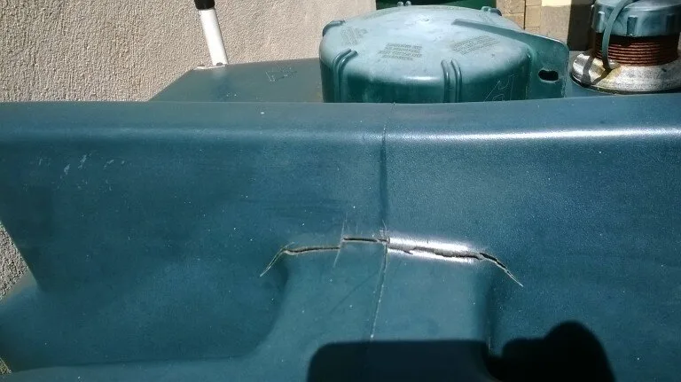

Your oil tank is not something you generally think about – only when your oil runs out and it needs to be refilled. It is not an exciting subject – I mean you don’t start browsing for oil tanks for entertainment to see the latest model out this year!!!

But did you know that single skin oil tanks only come with a one-year guarantee? That means that one year after your oil tank is installed you are not covered by the manufacturer if your tank fails and you have an oil spillage. An oil spill can be devastating not only to your garden, but to your home and is extremely hazardous to your health. An oil spill clean-up can run in to tens of thousands of €’s depending on how much oil spills and where it runs to.

So how do you spot if your oil tank is coming to the end of its life and is potentially dangerous?

1) Colour – most oil tanks are a dark green colour. However, over time UV rays from the sun weaken the plastic and cause the plastic to turn a lighter green. This sunlight damage causes the plastic to become weakened and crack – a disaster if your oil tank is filled and you don’t know there is a crack.

2) Sagging – many people put their oil tank up on blocks to allow gravity to feed the oil into your oil boiler. However, many people do not support the middle of the tank, just each end. Over time the plastic starts sagging and bulging in the middle. Eventually this will fail altogether when the plastic becomes too thin and then your oil is lost.

3) Corrosion of metal fittings where the pipe connects to the tank – if this fitting corrodes or fails the oil can escape through the outlet. This can be a slow leak and you may not even notice the leak at first.

Regular inspection of your oil tank is essential. Most people have their oil tank stuck in a back corner of their garden with plants growing over it, so it’s hard to spot any issues. Boiler manufacturers recommend that you service your boiler once a year. Why not ask your plumber to inspect your oil tank at the same time.

So, what do you do if you need to replace your oil tank? We would recommend that you replace your single skin oil tank with a bunded oil tank – that is a tank within a tank. Yes, they are twice as expensive, but they come with a ten-year guarantee. The sun cannot get to the inner tank which holds the oil to damage it and break down the plastic, so it is unlikely to crack or fail. If the bunded oil tank is put on a solid base or supported in the middle, they will last a very long time. These tanks are much more safe and secure and give you peace of mind that the precious oil that you spend so much money on every year to heat your home is not going to end up in your garden.

TMG Plumbing & Heating Service would be happy to replace your oil tanks for you. If you would like a quote, give Tony a call on [051 577089](tel:051577089)

©Photo by fourniersltd
