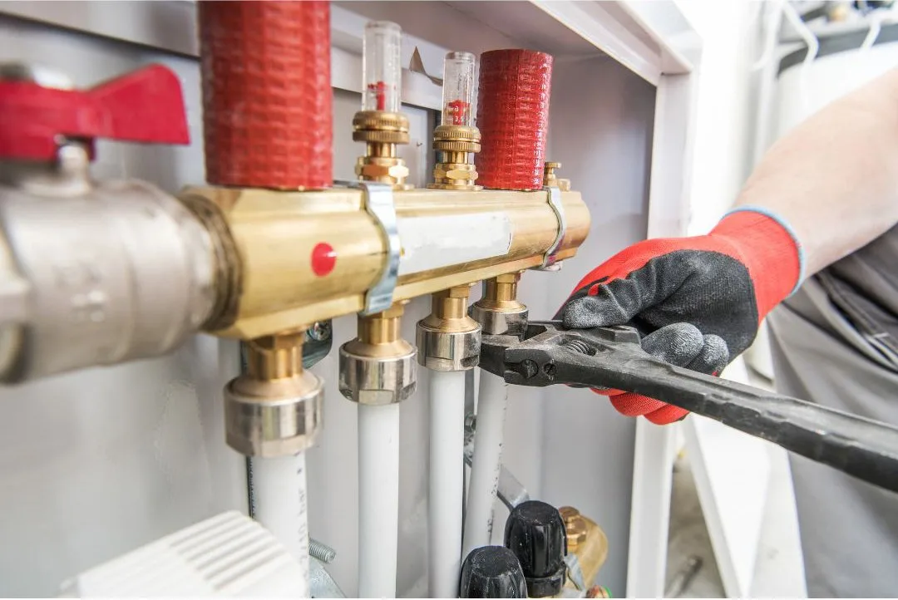

Underfloor heating has become an increasingly popular choice for homes and businesses, offering efficient warmth and improved comfort. However, like any heating system, it requires regular maintenance to ensure optimal performance and longevity. A common question that arises is: does underfloor heating need to be serviced? The answer is yes, and in this article, we’ll explore why servicing is essential, how often it should be done, and why flushing the system is a critical part of maintenance.

### Why Underfloor Heating Needs Servicing

Underfloor heating systems, whether water-based (hydronic) or electric, are designed to be low-maintenance, but they are not completely maintenance-free. Over time, various issues can arise that affect efficiency and performance:

- **Sludge and Debris Build-Up:** In water-based systems, impurities such as rust, limescale, and sludge can accumulate in the pipes, reducing efficiency and potentially leading to blockages.
- **Airlocks:** Trapped air within the system can hinder the circulation of warm water, causing cold spots in your flooring.
- **Pump and Valve Issues:** Components such as pumps, actuators, and thermostats may wear out over time and require servicing or replacement.
- **Reduced Energy Efficiency:** If the system isn’t maintained, it may consume more energy to produce the same level of heating, leading to higher energy bills.
- **Leaks and Corrosion:** Small leaks or corroded pipes can lead to costly damage if left unchecked.

### How Often Should Underfloor Heating Be Serviced?

The frequency of servicing depends on the type of system and usage. As a general guideline:

- **Water-Based Systems:** A professional service is recommended **annually** to check for sludge build-up, leaks, and airlocks.
- **Electric Systems:** While electric underfloor heating has fewer moving parts, it’s still advisable to inspect wiring, thermostats, and connections **every few years** to ensure safe operation. This should be done by a registered electrcian.
- **New Installations:** If you’ve recently installed underfloor heating, an initial check-up after the first year can help ensure everything is functioning properly before transitioning to an annual schedule.

### Why Flushing the System is Essential

For water-based underfloor heating systems, power flushing is an essential maintenance procedure. Flushing involves using a high-flow pump and specialist cleaning solutions to remove sludge, rust, and debris from the system. Here’s why it’s crucial:

- **Restores Efficiency:** Over time, sludge build-up can restrict water flow, making your heating system work harder to maintain the desired temperature. A flush removes these obstructions, restoring optimal performance.
- **Extends System Lifespan:** Regular flushing prevents long-term damage caused by corrosion and blockages, ultimately extending the life of your heating system.
- **Reduces Running Costs:** A clean system operates more efficiently, leading to lower energy consumption and reduced heating costs.
- **Prevents Cold Spots:** By removing airlocks and blockages, flushing ensures an even distribution of heat across the floor.
- **Protects Against Costly Repairs:** Neglecting maintenance can lead to expensive repairs or even a full system breakdown.

### Conclusion

Regular servicing of your underfloor heating system is essential to maintain efficiency, reliability, and longevity. Water-based systems, in particular, require annual servicing, including periodic power flushing, to prevent sludge build-up and ensure smooth operation. By keeping your underfloor heating system in top condition, you can enjoy consistent warmth, lower energy bills, and avoid costly repairs in the future.

At **TMG Plumbing**, we offer expert underfloor heating servicing and power flushing to keep your system running smoothly. Get in touch with us today to schedule your maintenance check and ensure your underfloor heating remains efficient for years to come.

**To schedule a job or to learn more about servicing your underfloor heating with TMG Plumbing & Heating Services call** [**051 577089**](tel:051577089)**or fill in the form on our** [**contact page**](/contact)
