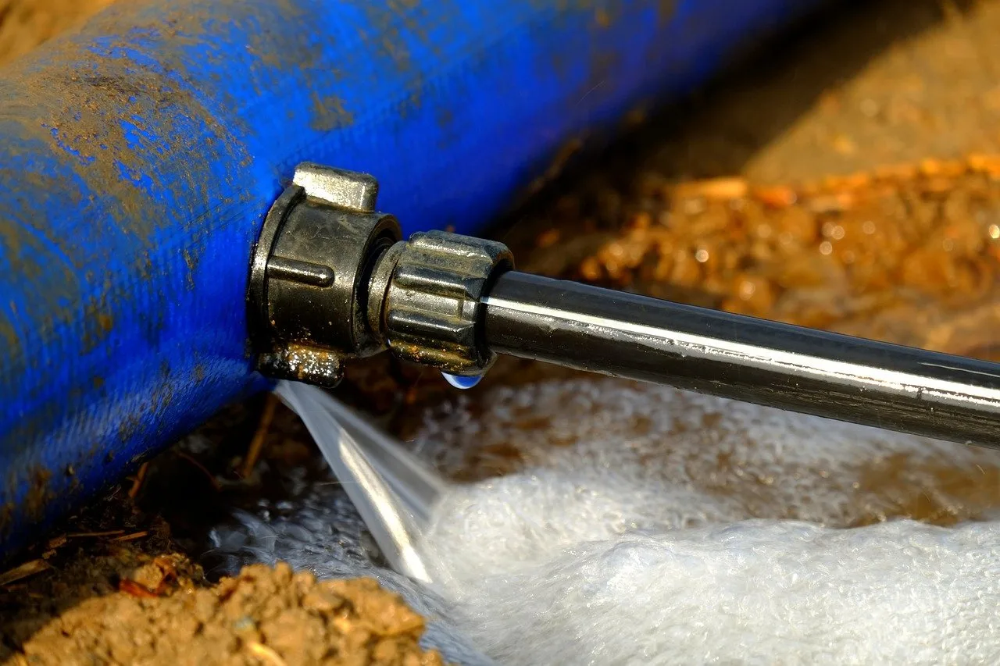
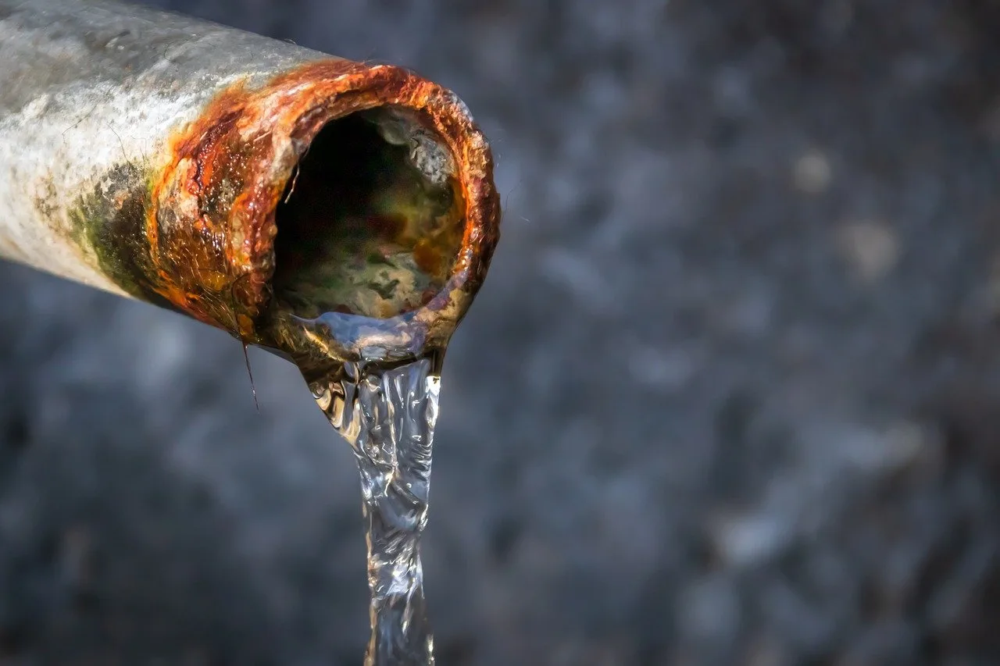
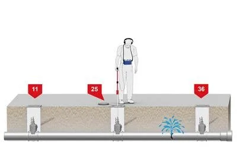
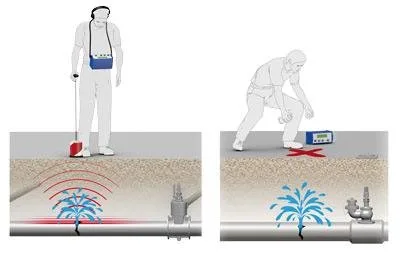

Have you recently noticed a drop in pressure to your water supply or your heating system? Is your heating system not working efficiently or do you keep having to top up the water in your heating system? This may indicate a leak on your water supply or on your heating system.

Water leaks can be extremely damaging to your home or business and can be very costly to repair if left untouched. Here’s some frequently asked questions to help you with your water leak.

## What is leak detection?

Leak detection is the process of identifying and locating leaks or seepages in various systems, such as plumbing, water mains, and industrial equipment, to prevent wastage and potential hazards.

## What are the common types of leaks that need detection?

Common types of leaks include water leaks in plumbing systems and leaks on water mains pipe work.

## What causes leaks?

It is a common misconception that only older houses get water leaks. Water leaks can also appear in new houses. In general, there are a few reasons that come together to cause water leaks.

As pipes get older, they rust and corrode. If the heating system is not regularly cleaned and filled with inhibitor, the pipe will eventually corrode from the inside out. This is particularly a problem in hard water areas where there is a lot of limescale in the water. Eventually the pipework will develop holes of weak areas.

Another reason for water leaks is a sudden change in temperature. Pipes expand and contract with the temperature. If there is a sudden drop in temperature the pipes can become brittle and crack due to pressure created inside the pipes.

Other issues of concern to homeowners could be punctured pipe work in underfloor heating pipes, shifting in pipes, poor workmanship or installation. Any of the above or a combination of all can cause your pipe work to leak.

## How do I know if I have a water leak?

Some indicators that you have a water leak are:-

· Pooling of water on the ground

· Cracks in concrete

· Damp or unusual discoloration of soil

· Water stains on walls or ceilings

· Damp spots on floors and walls

· Rising damp or black mould on wall and floor

· Bad odours especially around drains

· Sudden drop in water pressure

· Sudden drop in heating pressure

· Dirty or rusty water supply

· Gurgling noise on the heating system

· Constantly needing to top up boiler pressure

· Sound of running water when no fixtures are in use

If you suspect you have a water leak, it can be very difficult to pinpoint the exact location unless you have the proper equipment.

***If you think you may have a leak contact us to enquire about our leak detection services via our*** [***website***](/contact)***or call 051 577089.***

## What information will I need to provide the plumber to locate the water leak?

To make it easier and quicker to locate the leak, it would be helpful to provide the following information:

· Possible pipe locations

· Type of pipe you have

· Size of pipes

· Location of the shutoff valve

· Access to valves

· Access to heating controls and boiler

## Are all water leaks visible?

No, not all leaks are visible. Some leaks can be hidden behind walls, underground, or in concealed pipes, making them harder to detect visually.

## How do you detect the leak?

TMG Plumbing & Heating Services use thermal imaging, pressure testing and acoustic leak detection to detect where your leak is. This helps to pinpoint the leak more accurately so large areas of floors do not need to be dug up or removes.

Blockages of heating systems from rust can cause issues that may stop us finding the leak. In that instance the heating system may need to be power flushed to get the system clean enough to detect the leak.

## Can I use DIY methods for leak detection?

Some minor leaks may be detectable through DIY methods, such as checking visible pipes for signs of moisture or using food colouring to detect toilet leaks. However, for more complex or hidden leaks, it's best to rely on professional leak detection services.

## Can I just ignore the water leak if it doesn’t appear to be doing any harm?

Regardless of whether the leak appears to be doing any harm, it is not wise to ignore it. If a water leak is not addressed, this water leak can become a large problem and could become much bigger causing a lot of harm and damage to your property. This can lead to expensive and extensive renovations further down the line. By dealing with these water leaks when they are small, it prevents larger problems in the future.

## How much does water leak detection cost?

Rates for leak detection can vary depending on the type of house, time and location. Generally a price per hour or a quote can be given depending on the job.

## Is leak detection covered by insurance?

In some cases, insurance policies may cover the cost of leak detection and repairs if the leak has caused significant damage. However, coverage varies depending on the policy and the circumstances of the leak.

## Can leak detection prevent all potential leaks?

While leak detection can help identify and address many leaks, it cannot prevent leaks from occurring in the first place. Regular maintenance and timely repairs are essential to minimize the risk of leaks.

Remember, if you suspect a leak or notice any signs of water, it's best to contact a qualified professional for a thorough inspection and appropriate repairs.

***If you think you may have a leak in your property and would like to contact TMG Plumbing & Heating Services to enquire about our leak detection services,*** [***contact us via our website***](/contact)***or call 051 577089.***
