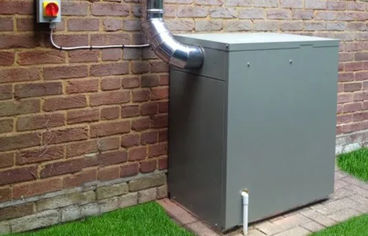
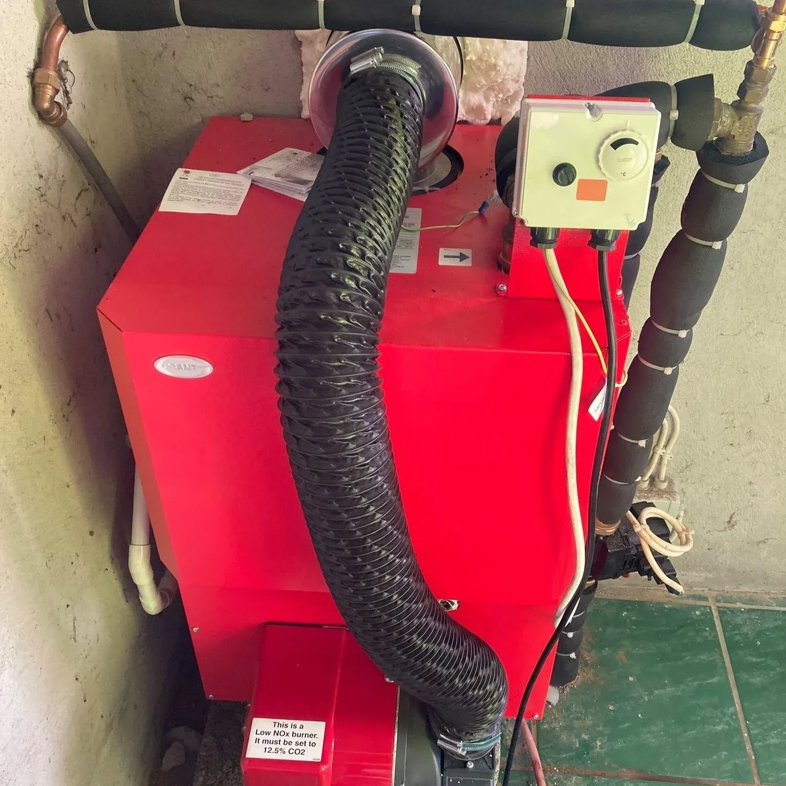
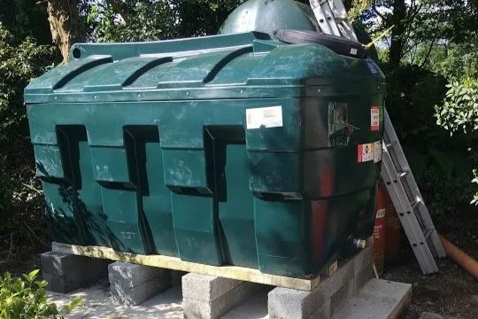
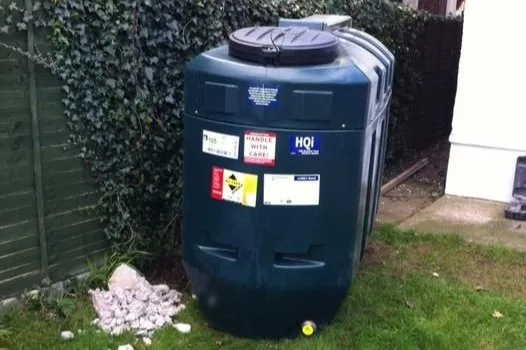

Oil is a fuel, that is not only extremely costly now but is also a fuel that can be easy contaminated. This can cause severe issues with your heating system. Water in your oil tank can cause the oil to congeal and clog the nozzles. Frozen water or air will block the oil line and lock out the boiler. So what do you need to do to maintain and prolong the life of your oil fired boiler?

#### Annual Service

Unlike most gas boilers, an oil boiler service involves a lot of actual cleaning and regular renewal of perishable parts. By performing a yearly inspection and maintenance, you can catch problems early on before they have the chance to become more serious.

#### Regular Maintenance

During a service the plumber will undertake a visual inspection of the tank, oil line and other parts of the oil fired system. You should undertake any remedial or maintenance works as soon as possible as any oil spillage or leak has costly and environmental consequences.

OFTEC recommends that oil fired boilers, tanks and equipment are serviced at least once a year.

#### Boiler Checks and Cleaning

The boiler works properly and efficiency when it burns the oil cleanly. When the boiler achieves ‘complete combustion’, the boiler get the most energy from the fuel. If the burner, fan, baffles etc are dirty and sooted then ‘incomplete combustion’ will occur, which means not all of the energy from the fuel is transferred to your heating system. This leads to waste fuel products – soot - building up inside the boiler and reducing the efficiency further.

#### Boiler Checks and Cleaning

- Check combustion chamber rope seal
- Remove the burner and fan and clean
- Clean and descale baffles
- Clean and descale the primary heat exchanger
- Remove, clean and replace turbulators
- Check combustion levels after cleaning

#### Tank and System Check

Inspect and clean condensate

- Test the fire valve
- Clean the condense trap
- Clean or replace the filter
- Carry out a visual inspection of the tank and oil supply pipe to check for damage, deterioration and debris
- Pressure test the oil supply pipe where it runs underground
- Check system pressure

For more information on why we recommend replacing your single skin oil tank with a bunded oil tank go to our blog post [Danger of Single Skin Oil Tanks](/blog/danger-of-single-skin-oil-tanks)

#### Preventative maintenance checks

You can do your own checks throughout year to ensure the system is well maintained and running efficiently:

#### Tank Checks

Check there are no signs of corrosion on a metal tank or bulging on a plastic tank

- Check that your plastic oil tank is not white in areas as this is where cracking will occur
- Check for leaks and physical damage
- Cut back any over-hanging trees that will continue to drip water onto the tank
- Check pipe joints
- Check for corroded seals around lids and hatches
- Check lids and caps are secure
- Check for water in the summer months that may build up due to condensation
- Visual check tank for leaks and physical damage
- Check all of the visible oil line for leaks
- Fit a tank monitor to be alerted to any sudden drops in oil which may be the result of a leak

#### Checking for Water Ingress

Use a garden cane or any long stick

- Coat in ‘water finding paste’ (available online)
- Dip into the tank to the bottom
- Wait the time period given on the instructions and pull out
- Check the colour against the chart to see if water is present

#### Purchasing Oil

Another area that affects whether your oil boiler runs smoothly and efficiently and prevents corrosion is the quality of oil that you burn. Using cheap low grade oil that is old or contains water will only cause your oil boiler to clog and corrode. O while saving you a small amount of money in the short term, it may be a costly mistake in the long term. Buying high grade, good quality oil/ kerosene will be better for your heating system for the future.

#### Run Your Boiler Regularly

While it is tempting to turn off your oil boiler in the Summer months and not to think about it until the weather gets cooler, it is a good idea to turn on your boiler regularly over the summer months for a short period of time to keep it in good working condition. By leaving it idle for months at a time it may not wok properly again when it is turned back on.

And remember, don’t wait until the cold nasty weather to get your boiler serviced. The ideal time to get your annual service is in late summer, early autumn so your heating system is ready for the winter use.

If you would like to enquire about getting your oil boiler serviced or replaced and your oil tank replaced fill in our form on [Contact Us](/contact) and we will be in touch.

©theheatinghub
