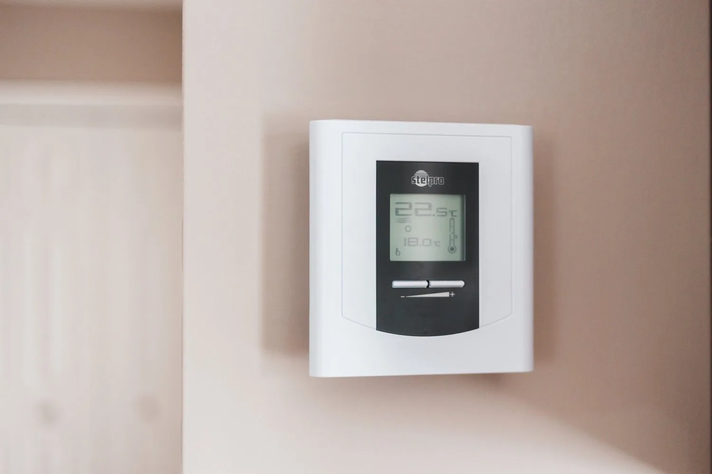
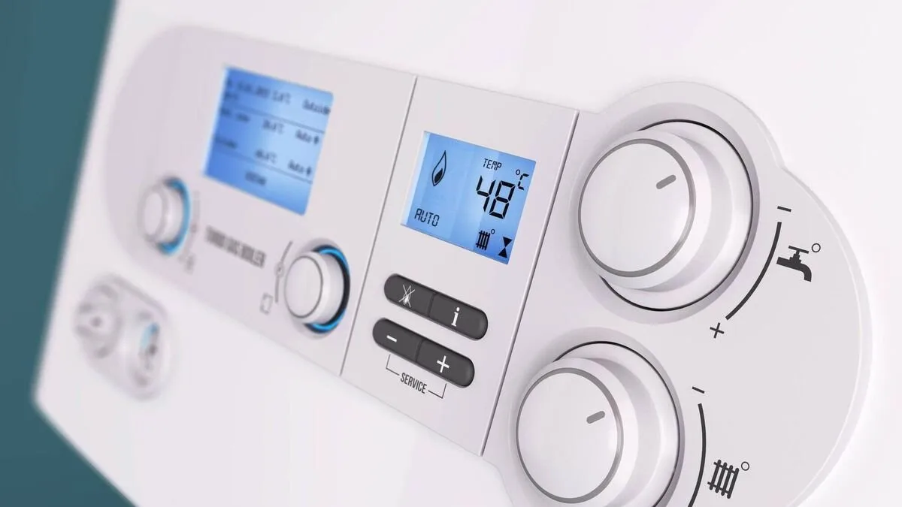
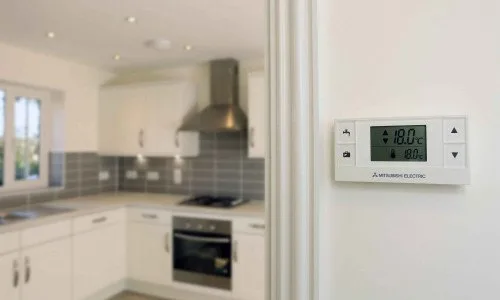
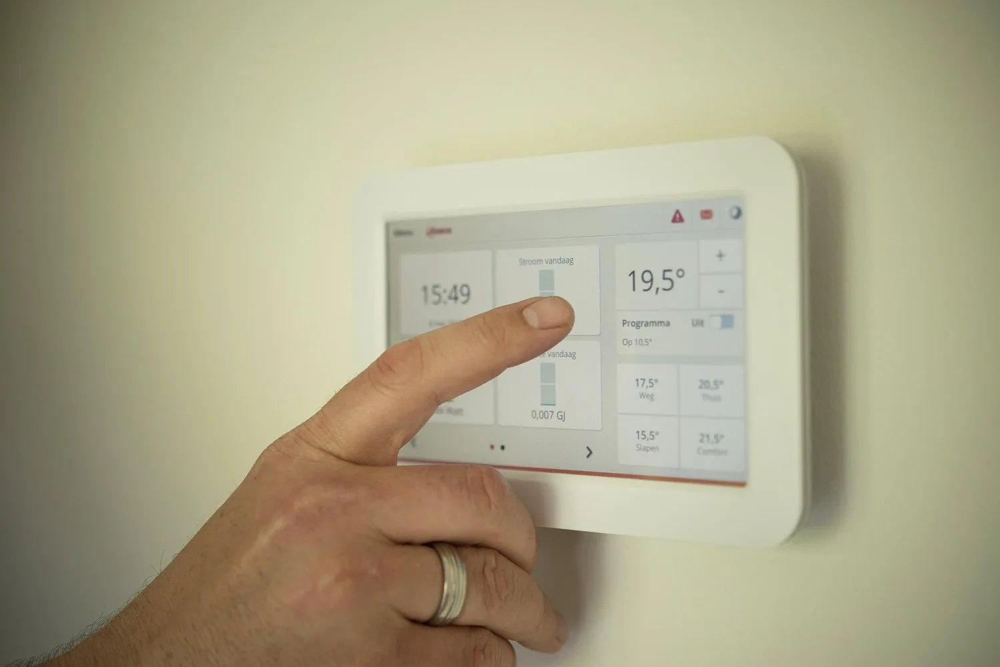
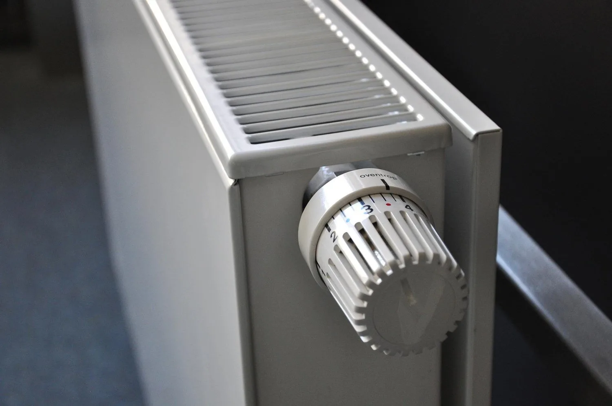
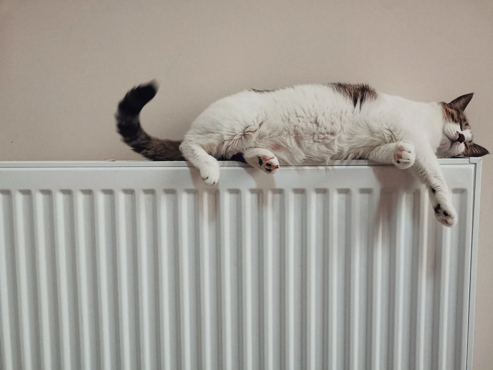
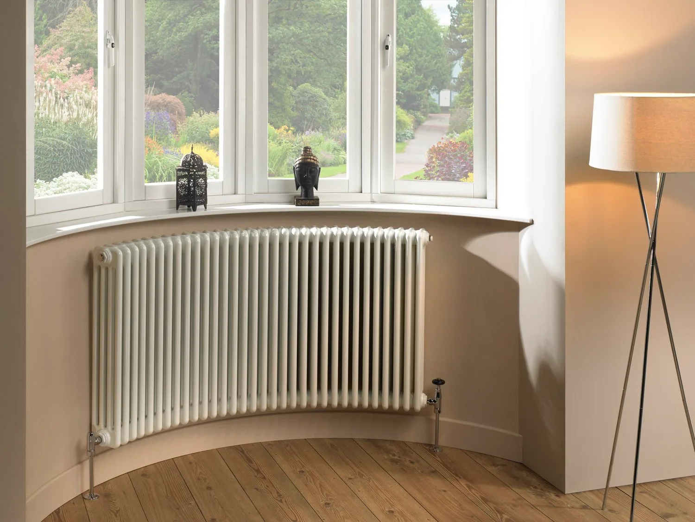
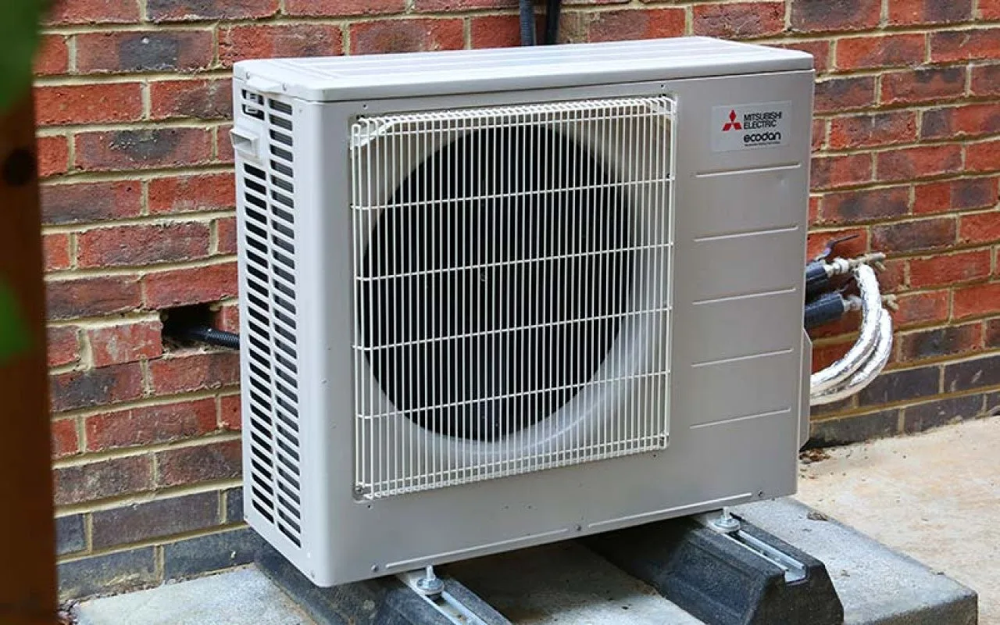
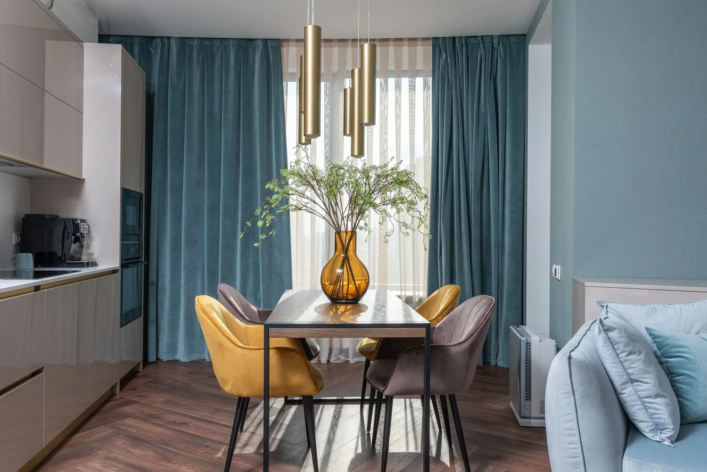

Heating and hot water has always accounted for a large part of our household expenses. With oil, gas and electricity costs at an all time high, now more than ever, we need to find ways to make our heating systems more efficient and our money stretch further. Even just some small adjustments can help to lower your bills by a significant amount. The following are some of our tips and advice to help you run your heating system more efficiently.

#### 1. Update your boiler

Old boilers can cost more to run than new boilers and are less efficient. Older oil boilers tend to be only 60% to 70% efficient and will decrease in efficiency as they age. New boilers are between 85% and 95% efficiency with condensing boilers being the most efficient so it is worth taking a look to see how old your boiler is and if you can afford to replace your boiler.

#### 2. Update your heating controls

If you can’t afford to replace your boiler or decide that your boiler does not need replacing you can take a look at your heating controls. There are various types of heating controls depending on your heating system but generally most heating systems allow for the following controls:

- Boiler timer - turns on and off your boiler at set times
- Heating programmer - allows you to set different times and temperatures for each day of the week
- Room thermostats - tells you how warm your room is and turns on and off the boiler accordingly to the temperature you set it to
- Thermostatic radiator valves (TRVs) - allows you to turn on and off individual radiators and adjust the temperature according to the room
- Smart thermostats - allows you to control turning on and off your heating system remotely and adjust the temperature of your heating system.

SEAI are now offering a grant for household to upgrade their heating controls of up to €700 - to find you more information on this click on [SEAI](https://www.seai.ie/grants/home-energy-grants/heating-upgrade-grants/)

#### 3. Set your boiler correctly

During the winter your boiler should be on the highest setting. At warmer times of the year your boiler temperature can be lowered. Otherwise it is heating water up to a higher temperature than necessary which will waste energy. See your boiler manufacturers instruction manual for more details.

#### 4. Zone your heating system

In newer houses, a zoning system is used where separate heating circuits can be controlled by different room thermostats and timers. Usually this means that the living area, bedroom area and hot water are on separate zones and can be turn on and off, up or down individually so the whole house does not need to be heated at once if not needed. This can also be installed in older houses. By zoning your heating system, you have much more control over when and how long an area needs to be heated or how high the temperature needs to be.

#### 5. Programme your heating system

By timing or programming your boiler, you have much more control over when you need your heating system or hot water turned on and off. It allows you to set both heating and hot water for different times on different days depending on your schedule. It also helps with efficiency as the boiler turns off automatically when programmed to so no more forgetting to turn the heating off when you leave the house. These programmers also allow you to put in holiday periods when you do not need the heating system but to turn it on for your return home. There are many devices to choose from on the market, as simple or as complicated as you like. Smart programmers are available also that allow you to programme everything from an app and control it remotely if necessary which comes in handy if you are later home than usual.

#### 6. Use your room thermostats wisely

According to Electric Ireland, by turning down your room thermostats just one degree, you can save up to 3% off your energy bill. Usually living areas are set to a temperature of 21 degrees and bedroom areas are set to 18 degrees. It makes sense that the lower the temperature, the less energy you use. Room thermostats need a free flow of air to work properly so do not cover them up and it is best to have the thermostat installed in a room you use all the time instead of a less used area on your house so you can judge accurately the temperature that is right for you.

#### 7. Set your thermostatic radiator valves correctly

Your TRVs allow you to set the temperature of the radiators and the room up or down. These work very well in rooms that are seldom or very rarely used in the house. The radiators in these rooms can be turned off or down low so that the boiler does not have to work so hard to heat up every room but only the ones that you use on a regular basis.

#### 8. Balance your heating system

If your heating system is not balanced properly you could be over heating one area which you rarely use to get the correct temperature in another area that you use all the time. this makes your heating system less efficient. By balancing your radiators you are getting the correct temperature to the right areas, therefore spending less money heating your home. If you have installed a new boiler, make sure your installer balances your heating system also.

#### 9. Clean your heating system

Make sure that the water in your heating system is clean and free from sludge. If you have cold spots on your radiators or in your underfloor heating, the chances are that there is a build up of sludge in your heating system. This means that the heating system has to work harder to get the radiators or underfloor heating up to the correct temperature and makes your system inefficient, costly to run and can wear out your boiler. Research suggests that a heavily blocked heating system can increase your bills by up to 25%.

By bleeding or removing the air from your radiators on a regular basis, this also helps to keep the radiators functioning efficiently. If your radiators gurgle when they are turned on, the chances are that their is air in them which stops the water from heating efficiently in your system.

Your heating system may need to be power-flushed. To find out more about this services go to our [Power Flushing](/services/power-flushing) page or our blog on

[Power Flushing Heating Systems - Frequently Asked Questions](/blog/powerflushingfaq)

#### 10. Install an energy efficient heating system

All new houses must have heat pumps installed instead of gas or oil boilers. However, there is also a growing move to switching out existing boilers for heat pumps. While this is not always straight forward, the SEAI are now giving grants towards helping home owners to make this switch which you can find out more about [here](https://www.seai.ie/grants/home-energy-grants/heat-pump-systems/).

If you would like to learn more about heat pumps go to our blog [Heat Pumps - Frequently Asked Questions](/blog/heatpumpsfaq)

#### 11. Simple things make all the difference

Using items like draft excluders and curtains can help to keep your room warmer and cut down on the amount of time you need to have your heating system turned on. Don’t block your radiators with furniture or curtains. Keep your heating vents clear to allow a free flow of air for your heating system to work efficiently in your room.

Photo credit : Mitsubishi, EPH Controls, Grant Engineering, Radiator Factory, Irish Examiner
