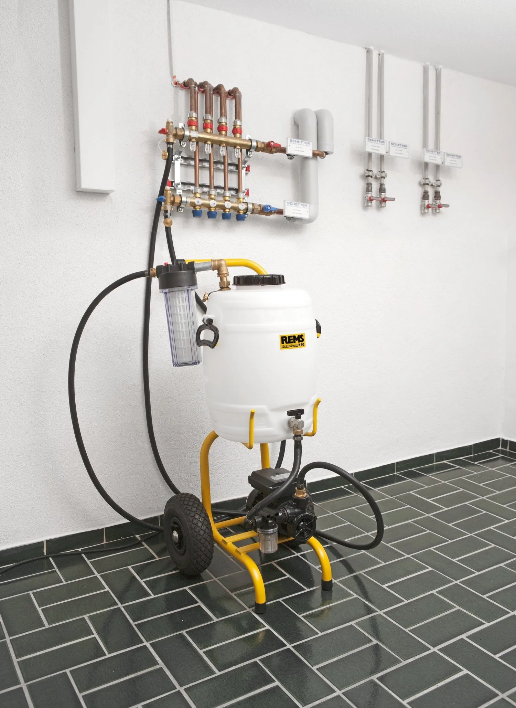
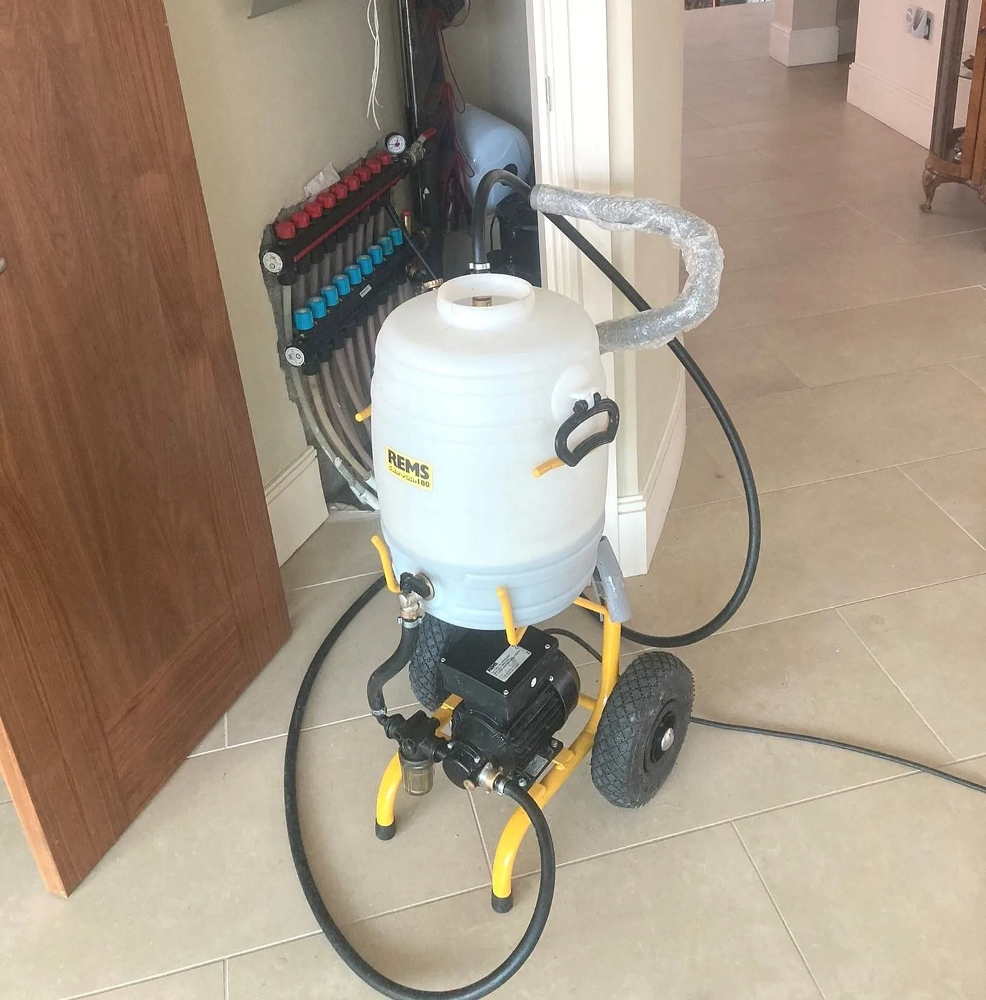

## What is power flushing?

Power flushing is a way of cleaning your central heating system whether it is radiators or underfloor heating. Over time, grime, sludge, limescale and metal oxides build up in your heating system and can cause blockages. This slows down the hot water circulating around your heating system, causing cold spots on radiators or underfloor heating. It also puts your boiler and pumps under pressure as they must work harder to get the hot water flowing through your system. By powerflushing your heating system, to helps to eliminate cold spots and helps your boiler and pumps to work more efficiently.

To enquire about a power flush for your heating system please contact us on 051 577089 or fill in our [contact us](/contact) form and we will get back to you.

## What does power flushing do?

Power flushing your central heating system or underfloor heating system cleans out all the grime, sludge and metal oxides that build up in your pipework and radiators over time. This build-up causes blockages in your radiators and pipework. This means that your heating system is not running efficiently and may cause your boiler and pumps to break down as they are under constant pressure trying to heat your home. By powerflushing your system this removes the blockages and metal particles that can degrade your heating system and allows your boiler and pumps to run efficiently and properly.

## Does power flushing really work?

Power flushing your heating system is an effective way of cleaning your central heating system with radiators or underfloor heating system removing cold spots and blockages and helping your entire heating system to run more efficiently and effectively. However, if a part of your heating system is broken or not working, powerflushing will not fix that. This will have to be fixed additionally

## How does power flushing work?

Firstly, your heating system is drained of all water. A cleaning chemical is then pumped into the heating system by using a power flushing machine. This power flushing machine pumps the cleaning chemical around the heating system at high velocity, low pressure, dislodging the sludge and cleaning all the pipes and radiators getting rid of the build-up of all the sludge and grime that builds up in your heating system over time without damaging the system. At TMG Plumbing and Heating Services, we also use an extra filtering system called a magnet cleanser which removes all metal oxide particles in your heating system that can cause pin holes in your radiators and damage your boiler. The heating system is then refilled with an inhibitor which helps to prevent further build up in the future.

Here at TMG Plumbing & Heating we specialize in powerflushing heating systems. To enquire more about this contact us through our [contact form](/contact).

## How long does power flushing take?

At TMG Plumbing and Heating Service, our power flushing services is normally conducted over two visits. Firstly, we will evaluate your heating system to see what it requires and then return to powerflush your heating system. This can take from 4 -6 hours to complete and causes minimal disruption in your home.

## How much does power flushing cost?

The cost of power flushing you home depends on the size of your heating system, how many radiators or length of underfloor heating pipe there is and how badly blocked your system is. We will assess your boiler and pumps and let you know exactly what is needed to get your heating system running in top condition.

To discuss your requirements, please call us on 051 577089 or fill in our [contact us](/contact) form and we will get back to you.

## How often should I get my heating system flushed?

Depending on your heating system, we would recommend that you would power flush your system every 5 years. After the initial powerflush, an inhibitor is pumped into your heating system which helps to prevent sludge building up. We would recommend that you get your heating system checked one a year to make sure that it is working effectively and efficiently.

## Can underfloor heating be power flushed?

Yes they can. There may be particles, debris or air that is causing blockages in your underfloor heating. By power flushing the underfloor heating system it will help to remove these blockages. If your system is a mix of both radiators and underfloor heating, sludge and metal debris from corrosion can travel into your underfloor heating system and cause blockages. By powerflushing the entire system it will clear the sludge and build up and help your entire system to run better.

If you have any questions or queries regarding power flushing your heating system, please contact us on our [contact form](/contact) and we will arrange a site visit.

## Can radiators be power flushed?

Yes they can. Over time corrosion in the radiators cause a build up of sludge and metal oxide to build up in the radiators causing blockages and cold spots in your radiators. This corrosion can cause pin holes in your radiators so power flushing can prevent this from happening. However, power flushing a very old system which already has a lot of corrosion cannot guarantee that there will be no existing pin holes in the radiators. As powerflushing is done at high pressure this may cause these pin holes to become more apparent on an old heating system.

## What are the benefits of power flushing my heating system?

Cleaning your heating system will remove any lime, sludge, grime and metal oxide build up that reduces the efficiency of the entire heating system. This gives your heating system a clean start. It helps your heating system to work more efficiently, heating up quicker and reducing the amount of oil, gas and electricity needed to run it. It removes cold spots on your radiators or underfloor heating. It helps your boilers and pumps to work better, last longer and run more efficiently. It prevents pin holes in your radiators causing leaks and air in your heating system.

## When should I get my heating system power flushed?

If you have noticed the following issues with your heating system, power flushing may be the answer:-

- Your heating system is taking much longer to heat up than it used to
- You have cold spots in your radiators or underfloor heating
- Your radiators are leaking from pin holes forming
- Air is building up in your radiators and you must bleed them regularly
- Dirty water when you bleed your radiators
- Your boiler is making noises and it is using up more gas or oil and electricity to run your heating system
- Pumps or boiler break down
- If you have a new boiler installed it is good to power flush your system so your boiler can run at 100% right from the start.

## Why should I power flush my heating system?

There are many advantages to power flushing your heating system such as:-

- Improved energy efficiency
- Improved reliability of your heating system
- Lowers the chances of your boiler breaking down
- Increase the lifespan of your heating system
- Heating system warms up quicker
- Higher quality of heating and hot water
- Reduced noise from the boiler and radiators

## Is a power flush guaranteed to get all heating systems running 100%?

No not in all cases. In most cases, powerflushing your system will improve it greatly. However, in some cases the build up in radiators may have become solid and cannot be removed. In this instance the radiator will need to be replaced with a new one.

## Should I get my heating system flushed when installing a new boiler?

Yes, this is very important. If there is a build up of sludge, grime and metal oxide in your radiators this will build up in your new boiler causing it to become inefficient and worn done quickly. By powerflushing your heating system when the new boiler is installed, it resets your whole heating system allowing the boiler to start running with a clean system, prolonging it’s life and helping it to run more effectively.

**To enquire about a power flush for your heating system please contact us on 051 577089 or fill in our** [**contact us**](/contact)**form and we will get back to you.**

Copyright pictures Rems.de
