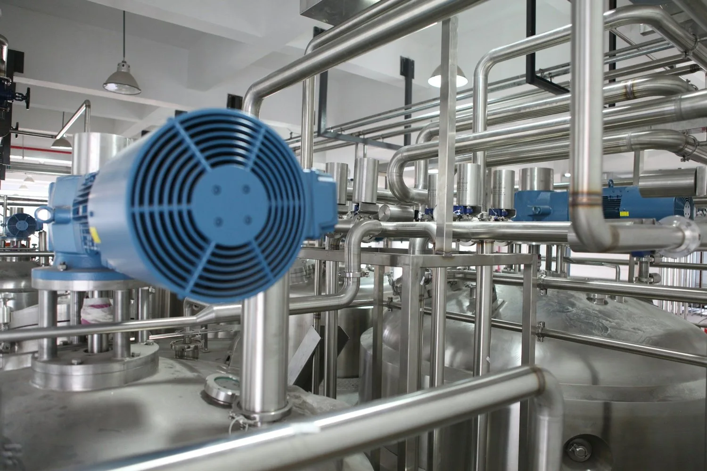
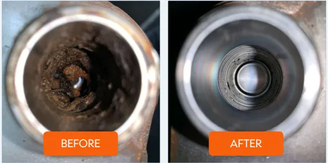

Heating systems, particularly in industrial and commercial settings, work under heavy demands. Over time, these systems accumulate dirt, sludge, rust, and other mineral deposits, significantly reducing efficiency and risking costly repairs. TMG Plumbing specializes in [**Industrial Power Flushing**](/commercial/industrial), a solution designed to restore the health of your heating systems and ensure optimal performance.

## What is Industrial Power Flushing?

Industrial power flushing is a professional cleaning process that uses purpose made pumps and special filters to remove sludge, rust, and debris from heating systems. This process clears blockages, improves water flow, and restores system efficiency. With high-powered equipment, trained technicians can target and remove years of build-up, preventing cold spots, improving heat distribution, and reducing the energy consumption of heating systems.

## Why is Power Flushing Important for Industrial Heating Systems?

Industrial heating systems are often large, complex, and essential for a business’s operations. The buildup of debris and mineral deposits reduces their ability to generate and distribute heat, causing inefficiencies, uneven heating, and higher operating costs. A neglected system can lead to breakdowns and expensive repairs.

Regular power flushing helps maintain:

- **Consistent and Efficient Heating**: Eliminates cold spots and improves heat distribution throughout the system.
- **Energy Efficiency**: Removing deposits enables the system to operate with less energy, which translates to lower heating costs.
- **Longer Equipment Life**: Reducing the strain on components helps them last longer, saving on replacement costs.

## Benefits of Demineralising Heating Systems

Mineral deposits in heating systems cause a variety of issues, from corrosion to blockages. Demineralising the system during the power flushing process offers additional benefits that greatly improve the performance and durability of the system.

1. **Prevents Corrosion**: Mineral deposits encourage corrosion, especially in metal pipes and components. Demineralising the system protects against rust and extends the life of metal parts.
2. **Improves Heat Transfer**: Mineral deposits reduce heat conductivity. Demineralisation removes these blockages, enhancing heat transfer and system efficiency.
3. **Reduces Maintenance Costs**: Demineralised systems require less maintenance, reducing costs and downtime for repairs.
4. **Improves Water Quality in Closed Systems**: By removing excess minerals, demineralisation helps maintain the water quality, reducing issues caused by hard water and extending the life of seals and components.

## How Can You Tell if Your Heating System Needs Power Flushing?

Several signs indicate that your industrial heating system may need power flushing:

- Cold spots on radiators or pipes
- Increased energy consumption
- Unusual noises, such as banging or gurgling
- Slow warming of the heating system
- Frequent breakdowns or pump failures

## Why Choose TMG Plumbing for Industrial Power Flushing?

With years of expertise in industrial plumbing, TMG Plumbing provides reliable and efficient power flushing services tailored to large-scale systems. Our team of trained technicians uses advanced equipment to ensure a thorough cleaning process, including demineralising treatments that prevent future buildup and corrosion.

## Contact TMG Plumbing Today

Invest in the long-term efficiency and health of your heating system. Reach out to TMG Plumbing today to discuss industrial power flushing and demineralising services, and let our experts bring back the peak performance of your heating system.

**To schedule a job or to learn more about the demineralising filtration with TMG Plumbing & Heating Services call** [**051 577089**](tel:051577089)**or fill in the form on our** [**contact page**](/contact)
