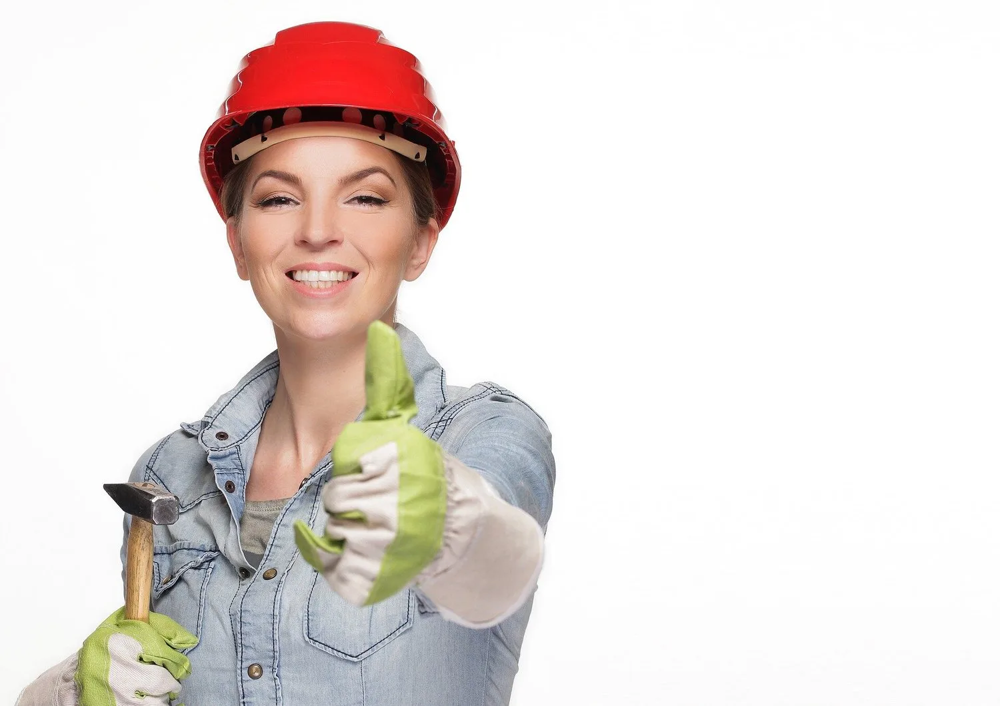

Most people don’t think about the work a tradesperson does until something goes wrong in their house or business premises. And we have heard of those horror stories, where a “tradesperson” has come to fix and install something and has left a nightmare behind for someone else to fix.

I recently had a case where I was called out to a house where a heating system had been installed several years ago by another plumber and two of the radiators had never worked. When I investigated the reason why, I discovered that the pipes coming from the radiator looked like they were part of the system but in fact were just running into the floor and had never been connected.

These type of people give tradespeople a bad name and many householders and business owners under estimate and under value a qualified tradesperson.

Many people don’t realise the amount of training and education that a tradesperson needs to go through to become qualified. For example, becoming a fully qualified, certifiable and reputable plumber is no short task. To begin with an apprenticeship consists of four on-the-job phases with an approved employer and three off-the-job phases in an educational organisation. This apprenticeship is deemed to be complete when an apprentice has successfully completed all on-the-job and off-the-job phases of their apprenticeship, which is a minimum of four years in duration from the date of registration. They then need to build up their experience and are most likely put through their paces on a building site. On top of that there is new heating and plumbing systems becoming available constantly with new technologies, particularly in green energy. To install and repair these systems a plumber has to train and be certified in each system and register with the relevant governing bodies.

As a plumber, not only do you need to have a wide range of knowledge in heating and plumbing but general building, carpentry and occasionally electrical knowledge to get repairs and installations done and to know which other tradespeople are needed. On most jobs, you will use power tools and even sometimes welding and soldering equipment.

As a plumber who attends emergency callouts, you sometimes have to work late into the evening and weekends and often have to work in tight and confined spaces so claustrophobia is not a good thing to suffer from. Plumbing is not only a physical job but requires quick thinking and good problem solving abilities.

So when you are looking for a tradesperson to do work in your home, make sure they are fully qualified and have received their Craft cards. And if you find a good tradesperson, appreciate that they have had to hone their skills over years of hard work and experience. Hang on to their numbers – they are invaluable!!
