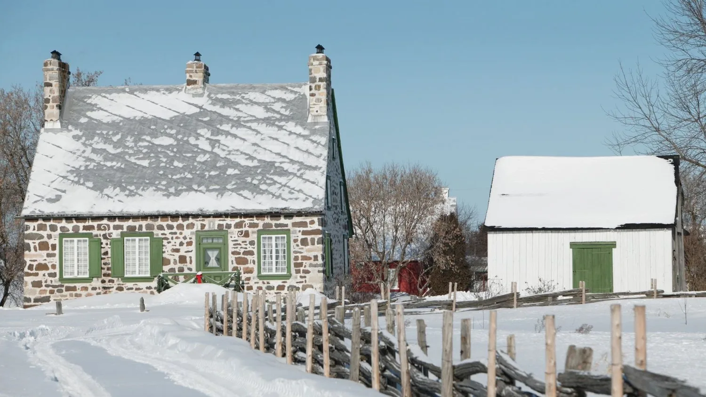
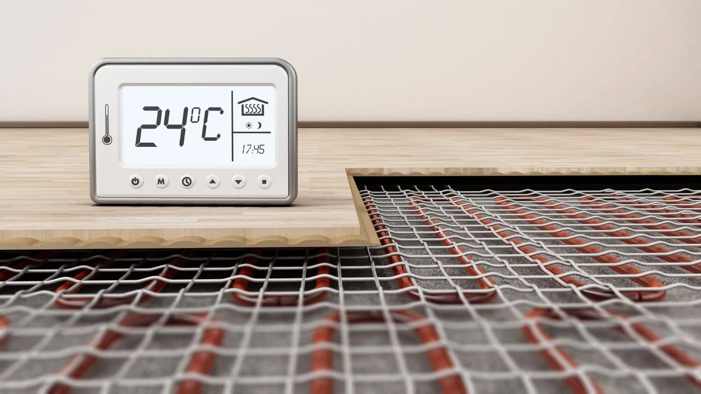
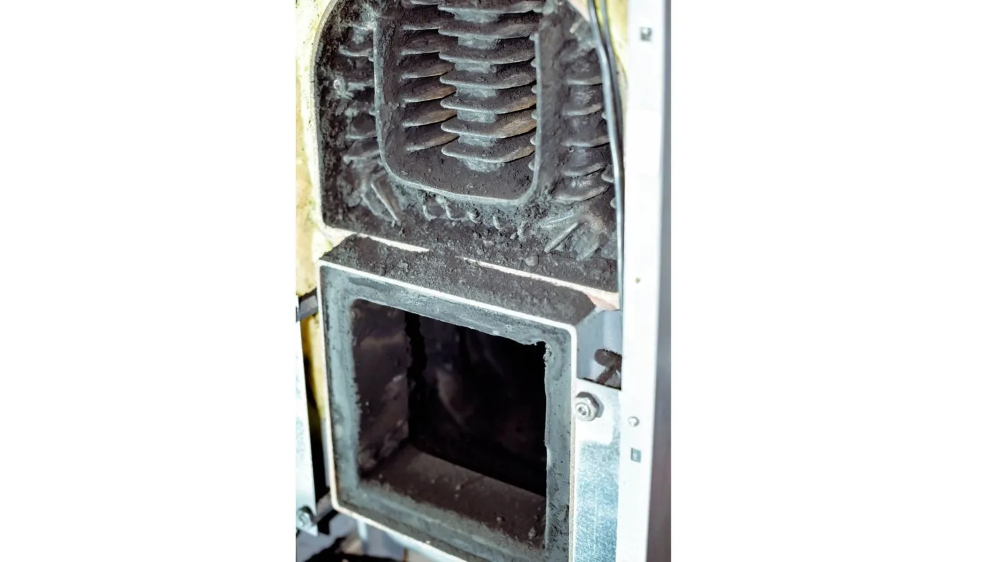
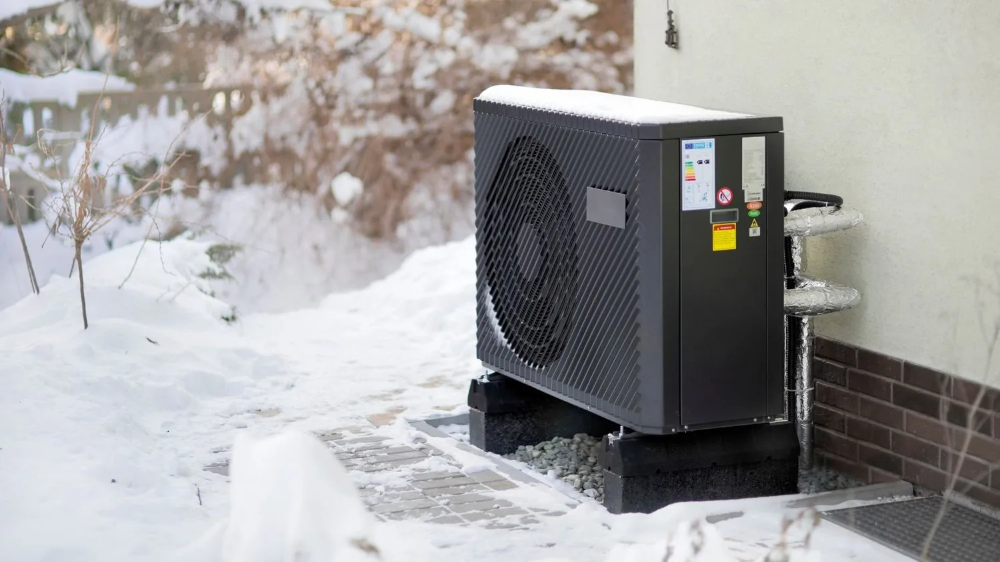
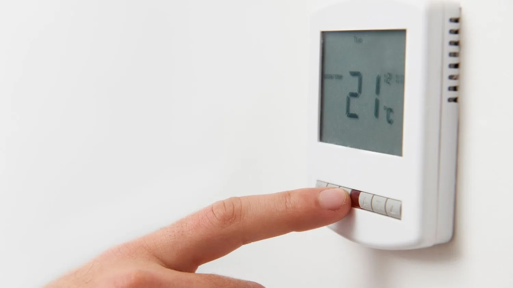
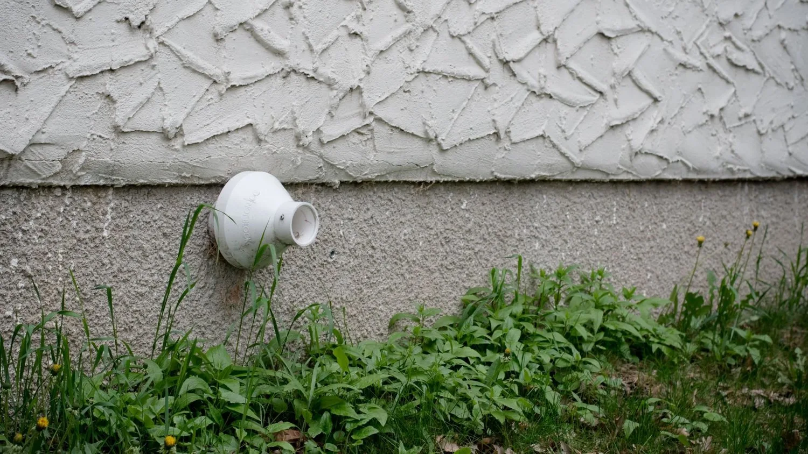
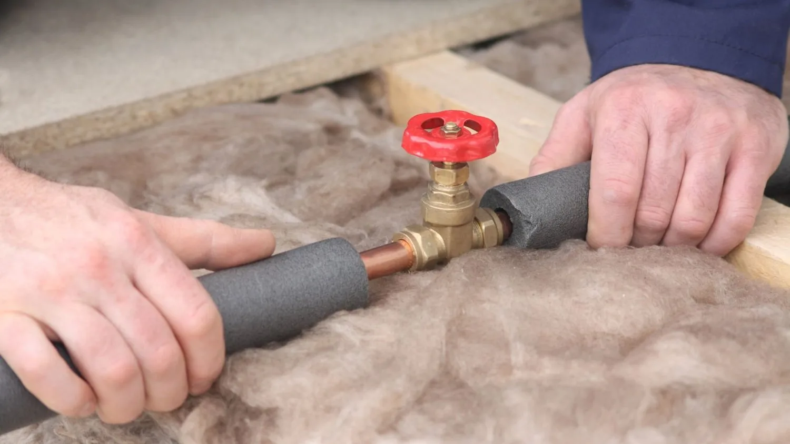
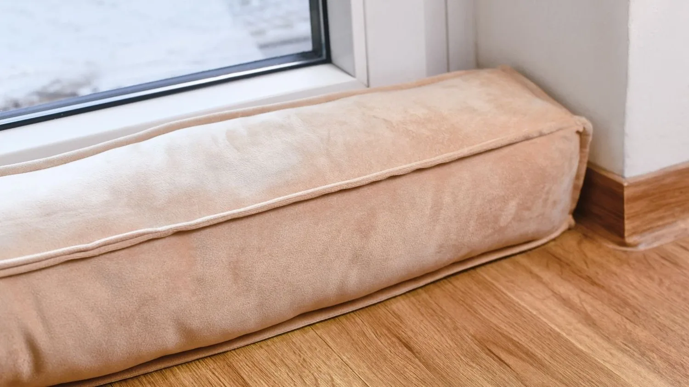

Winter is just around the corner, and for many of us, this means cosy nights by the fireplace and keeping warm indoors. But for your home's heating system, it means a period of hard work to keep you and your loved ones warm. TMG Plumbing is here with our top tips to ensure your heating system, be it radiators or underfloor heating, works smoothly throughout the chilly season.

As we all know, regular maintenance is the key to prolonging the lifespan and efficiency of any system, and your heating is no exception. Our clients, can all attest to the difference a well-maintained heating system makes. So, here we go!

## 1. Check and Bleed Your Radiators

- *Tip*: Cold patches at the top while the bottom is warm often indicates trapped air.

- *Action*: Use a radiator key to bleed them. Open the valve slowly and when water starts to drip, close it. This process releases trapped air, allowing the radiator to heat up efficiently.

## 2. Regular Maintenance of Underfloor Heating

- *Tip*: The efficiency of underfloor heating can decrease if there's air trapped in the system.

- *Action*: Ensure to bleed the system and regularly check for any signs of damage or wear.

## 3. Oil Boiler Check

- *Tip*: An oil boiler can become inefficient due to sediment build-up.

- *Action*: Schedule an annual service. This will involve cleaning out any sediment and checking the system for potential issues.

## 4. Inspect Your Heat Pump

- *Tip*: A malfunctioning heat pump might freeze during the winter.

- *Action*: Check for any signs of frost or ice. If you see a build-up, switch off the pump and call a professional.

## 5. Thermostat Settings

- *Tip*: Avoid constant adjustments.

- *Action*: Set your thermostat to a comfortable temperature and use programmable settings for when you're out.

## 6. Clear External Vents

- *Tip*: Blocked vents can reduce system efficiency.

- *Action*: Ensure that all external vents are free from leaves, snow, or any other obstructions.

## 7. Insulate Pipes

- *Tip*: Frozen pipes can burst and cause considerable damage.

- *Action*: Insulate any exposed pipes, especially those outside or in unheated areas of your home.

## 8. Check for Draughts

- *Tip*: Cold air entering your home can make your heating system work harder.

- *Action*: Inspect doors, windows, and any other openings for draughts and seal them.

Incorporating these tips into your regular maintenance routine will go a long way. As you prepare to enjoy the winter months, remember that a little proactive care can save you from unforeseen problems. Whether you're relying on traditional radiators or modern underfloor heating, the principle remains the same: a well-maintained system delivers the best performance.

And, while these steps might seem straightforward, never underestimate the peace of mind that comes from having a professional look at your system. TMG Plumbing is always ready to assist you. Let's face it, winter can be harsh, but with your heating system in top shape, it'll be nothing more than an opportunity to wear those comfortable jumpers and enjoy relaxing by the fireplace.

As we brace ourselves for winter, ensuring the efficient working of our home's heating becomes essential. This not only guarantees comfort but also saves on energy bills, making our heating systems more efficient. So, give your heating system the care it deserves with regular maintenance, and here's to a warm and delightful winter!

If you would like TMG Plumbing to do a maintenance check on your heating system, power flush your radiators or underfloor heating or replace your oil boiler, please fill in our [contact form](/contact) or call 051 577089
