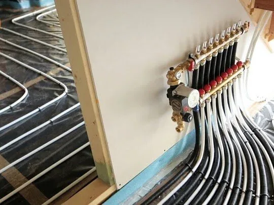
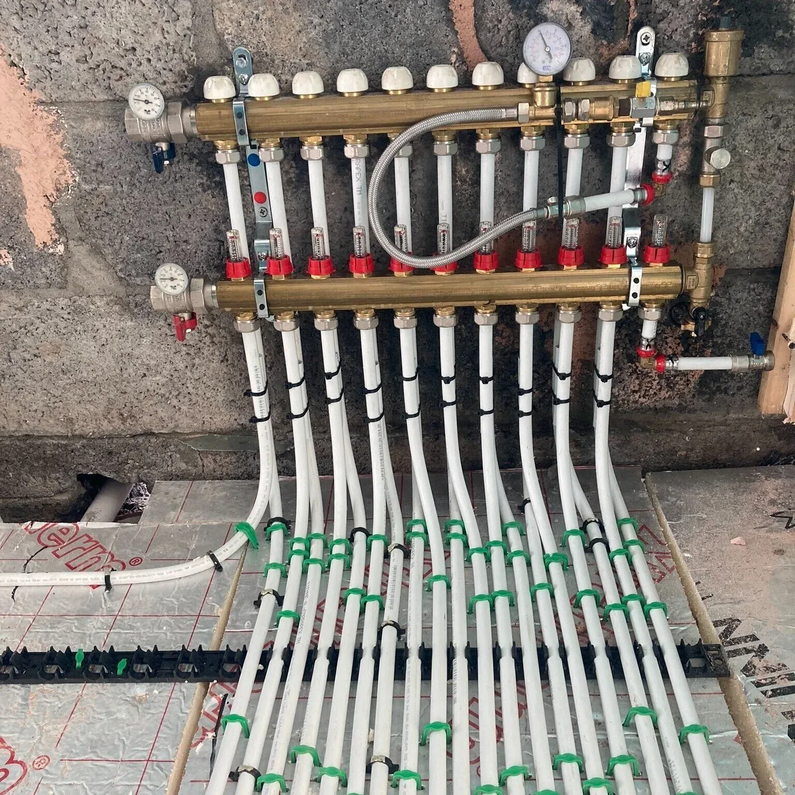
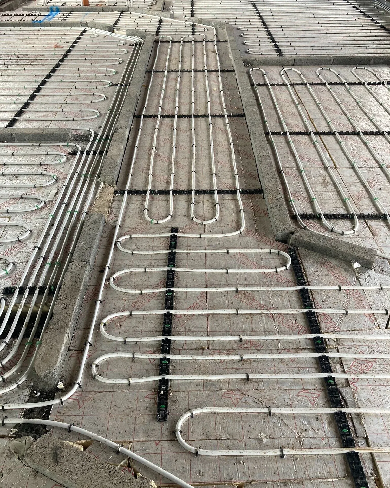

## How does underfloor heating work?

In general terms an underfloor heating system works the same way a radiator does. Instead of hot water running through your radiators to heat them up, the hot water runs through a piping system under your floor and heats from the ground up. The water is heated from either a boiler or from a heat pump.

## Does my underfloor heating need to be serviced?

Regular servicing of your underfloor heating is highly recommended. It’s always better to regularly maintain a system to ensure it is constantly running smoothly and efficiently. Servicing allows plumbers and heating engineers to proactively look out for signs of any failure in the heating system before anything major goes wrong and involves costly repairs or replacement. They can also offer tips to homeowners to maximise the efficiency of their heating system.

Whether your underfloor heating system is run from a gas boiler, oil boiler or a heat pump, these boilers will need to be regularly serviced like any other heating system. We recommend that this be done on a yearly basis.

Common problems that are associated with underfloor heating are trapped air in the system, incorrect or unbalanced flow rates, blockages in the system, wiring issues, zones not heating up adequately, and malfunctioning pumps. All these can be rectified by your plumber and heating engineer,

## Is underfloor heating more efficient than radiators?

Yes, generally underfloor heating is 30% more effective than radiators. It provides a more ambient heat rather than concentrated heating of a radiator so generally can also be run at a lower temperature also which helps with its efficiency.

## What do I do if I have air in my underfloor heating system?

Generally, there is a manual air bleed valve on the manifold that can be bled by using a normal radiator key. This can release any air in the system.

## What should I do if there is a leak or a fault on the system?

In this case, it is better to call a plumber who deals with underfloor heating systems. Turn of the heating and wait until they can inspect the system to determine the issue.

## Should I leave my underfloor heating on all the time?

It can take from two to three hours to get your underfloor heating up to the correct temperature when it is turned on initially, so it is recommended that during the coldest times of the year you leave your underfloor heating system on all the time. You can however adjust the temperature up or down depending on the occupation of the house at various times and the outside temperature. Generally underfloor heating is zoned for different areas so you can turn down the temperature in the bedrooms during the day when not in use and the living area at night.

## How long should it take for my underfloor heating to get up to temperature when it is turned on for the first time?

It may take up to a week or more to get your underfloor heating up to the correct temperature when it is switched on for the first time. This is because there may still be lots of moisture in the concrete slab and tiles. This all must dry out before the heating system will start to work efficiently. Your heating system should be turned on o the water temperature is approximately 25°C and gradually increased daily to 50°C until all the moisture is gone from the slab. It can then be turned down to the ambient temperature for your needs.

## What furniture can I put on top of the underfloor heating?

Free standing furniture with legs is generally fine on underfloor heating. However flat bottom furniture and very thick rugs or carpets may trap the heat and cause issues by restricting the flow and are not advisable to place on underfloor heating.

## Can I have different temperatures in different areas of the house?

Yes, you can zone your heating by linking the underfloor heating to thermostats in various rooms allowing you to adjust the temperature of each zone. Most people have the living area and sitting area on one zone and the bedrooms on another zone.

## What are the best floor coverings for underfloor heating?

Stone and ceramic tiles are probably the best floor covering to use with underfloor heating as these allow the heat to pass through them quickly and into the room. Timber and laminated timber flooring can also be used but solid timber will act differently to engineered flooring so it is essential to get the right thickness of flooring to allow heat to pass through. Having a rug over the timber flooring can trap the heat and damage the flooring so you need to be careful with placement and thickness of rugs.
