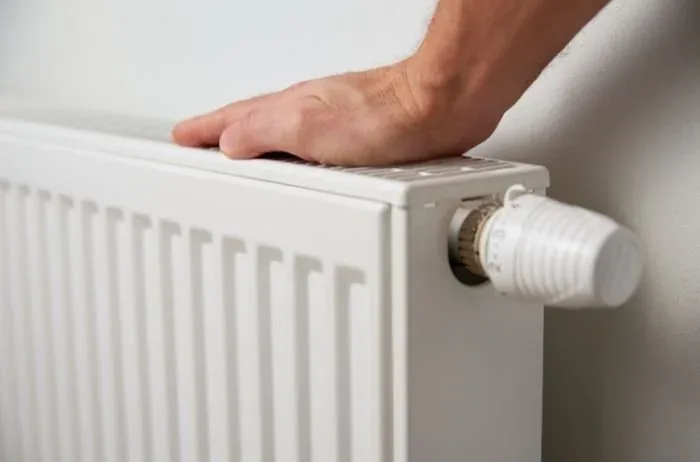
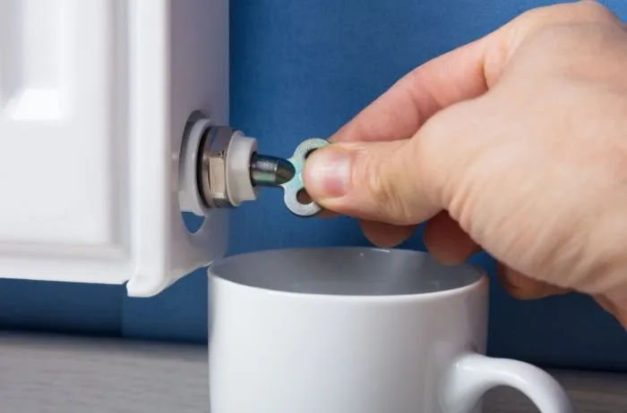
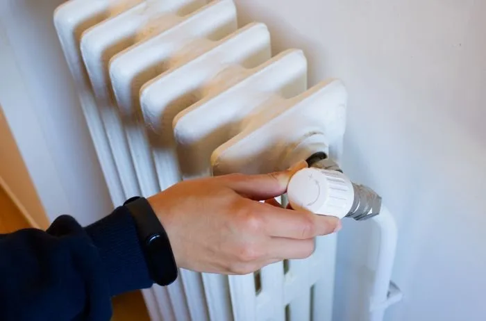
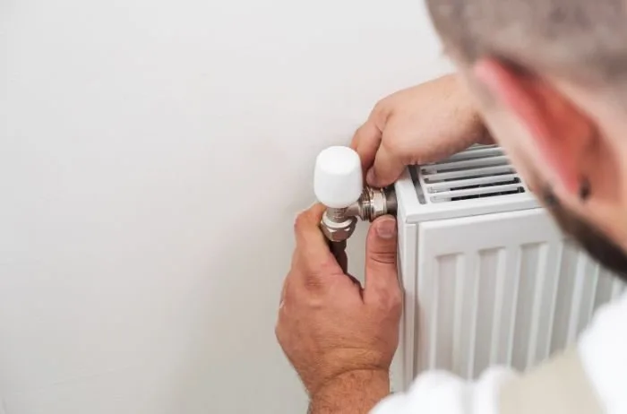
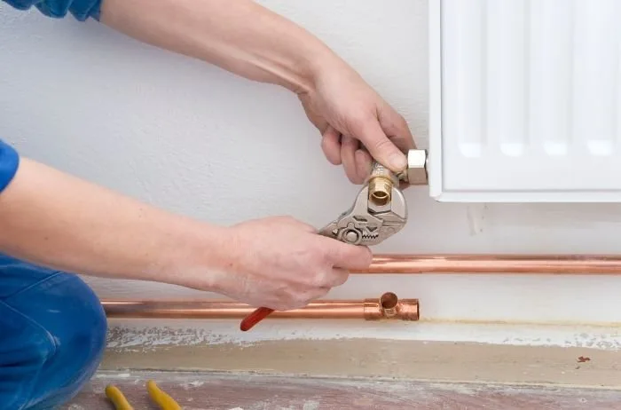
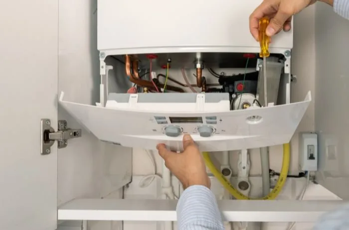

When you find your radiators not heating up as they should, it can be both puzzling and frustrating, especially during the colder months when you rely on them the most. There are several common reasons why your radiators may not be working efficiently, and thankfully, most of these issues can be resolved with some basic troubleshooting and remedial work. Below are some of the most frequent causes for radiators not heating up and some practical solutions to help you restore heat to your home.

### 1. Trapped Air in the Radiator

One of the most common reasons for a radiator not heating up properly is trapped air. When air gets trapped inside a radiator, it prevents hot water from circulating effectively, leaving your radiator cold at the top while warm at the bottom.

### Remedy:

Bleeding your radiators is a simple solution. Use a radiator key to open the bleed valve slightly until you hear the hiss of escaping air. Once water starts to dribble out, close the valve. This should allow hot water to circulate through the entire radiator.

### 2. Thermostatic Radiator Valve Issues

Thermostatic Radiator Valves (TRVs) allow you to control the temperature of individual radiators. If a TRV is stuck, it might not open to let hot water in, leaving the radiator cold.

### Remedy:

Try to free the valve by gently turning it back and forth. If this doesn't work, you may need to remove the TRV head to check if the pin is stuck and gently free it. If you're not comfortable doing this, it might be time to call a professional.

### 3. System Needs Balancing

If radiators further away from your boiler are cold while those closer are hot, your system might need balancing. This involves adjusting the valves on each radiator to ensure an even distribution of hot water throughout your home.

### Remedy:

Balancing radiators usually requires adjusting the lockshield valve (found under a plastic or metal cap on one end of the radiator) to regulate the flow of water. It can be a bit of a trial-and-error process and might require a bit of patience or professional assistance.

### 4. Blocked Pipes or Radiators

Over time, sludge can build up in your heating system, leading to blocked pipes or radiators. This sludge can prevent hot water from circulating properly, resulting in cold spots or completely cold radiators.

### Remedy:

Flushing your system can remove this build-up. A chemical flush involves adding a chemical cleaner to your system to break down the sludge, which is then flushed out with water. For severe blockages, a power flush, which uses high-pressure water to clear the system, might be necessary. These procedures are best left to professionals.

### 5. Boiler Issues

Sometimes the problem might not be with the radiators themselves but with the boiler. If your boiler is not working correctly or not producing enough hot water, your radiators will not heat up properly.

### Remedy:

Regular boiler maintenance is key. Ensure your boiler is serviced annually by a qualified professional to keep it running efficiently and to prevent future heating issues.

When your radiators are not heating up, it can make your home uncomfortable and increase your energy bills due to the inefficient heating system. By understanding the common causes, you can take steps to troubleshoot and fix the issue yourself or know when to call in a professional for help. Remember, regular maintenance of your heating system can prevent many of these issues from occurring in the first place, ensuring a warm and cozy home during the chilly seasons.

If you would like to enquire about getting your heating system maintained and power flushed please fill in our [contact form](/contact) and we will get back to you.
